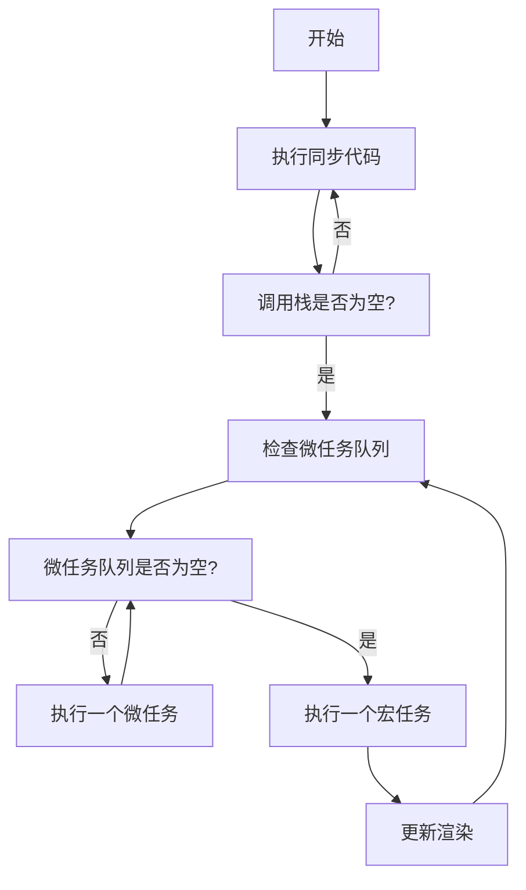

# JavaScript事件循环深度解析：Event Loop全攻略

> 你有没有想过：为什么setTimeout(fn, 0)不是立即执行？为什么Promise比setTimeout先执行？为什么浏览器能在执行JavaScript的同时还能响应用户交互？这些问题的答案都指向一个核心概念——事件循环（Event Loop）。

## 为什么需要事件循环？JavaScript的"单线程困境"

### JavaScript的单线程本质

JavaScript是一门**单线程语言**，这意味着它在任何时刻只能执行一段代码。但这带来了一个问题：

```javascript
// 如果没有事件循环，这样的代码会阻塞整个页面
function blockingOperation() {
  const start = Date.now();
  while (Date.now() - start < 3000) {
    // 什么都不做，只是等待3秒
  }
  console.log('3秒后执行');
}

console.log('开始');
blockingOperation(); // 这会阻塞3秒
console.log('结束'); // 必须等上面执行完才能看到
```

在没有事件循环的情况下，上面的代码会让整个页面"死机"3秒，用户无法进行任何交互。

### 事件循环的解决方案

事件循环让JavaScript能够：
1. **非阻塞执行**：长时间任务不会阻塞用户界面
2. **并发处理**：同时处理多个异步操作
3. **优先级管理**：不同类型的任务有不同的执行优先级

```javascript
// 有了事件循环，我们可以这样写
console.log('开始');

setTimeout(() => {
  console.log('3秒后执行');
}, 3000);

console.log('结束'); // 立即执行，不会被阻塞
```

## 事件循环的核心组成部分

### 1. 调用栈（Call Stack）

调用栈是JavaScript执行代码的地方，遵循**后进先出（LIFO）**的原则。

```javascript
function first() {
  console.log('first');
  second();
  console.log('first end');
}

function second() {
  console.log('second');
  third();
  console.log('second end');
}

function third() {
  console.log('third');
}

first();

// 执行过程中的调用栈变化：
// 1. [first] 
// 2. [first, second]
// 3. [first, second, third]
// 4. [first, second] (third执行完出栈)
// 5. [first] (second执行完出栈)
// 6. [] (first执行完出栈)
```

### 2. 任务队列（Task Queue）

当异步操作完成时，它们的回调函数会被放入任务队列中等待执行。

```javascript
console.log('1');

setTimeout(() => console.log('2'), 0);
setTimeout(() => console.log('3'), 0);

console.log('4');

// 输出顺序: 1, 4, 2, 3
// 解释：
// 1. console.log('1') 立即执行
// 2. setTimeout回调被放入任务队列
// 3. console.log('4') 立即执行
// 4. 调用栈清空后，处理任务队列中的回调
```

### 3. 微任务队列（Microtask Queue）

微任务有比普通任务更高的优先级，每次事件循环都会先清空所有微任务。

```javascript
console.log('1');

setTimeout(() => console.log('2'), 0); // 宏任务

Promise.resolve().then(() => console.log('3')); // 微任务
Promise.resolve().then(() => console.log('4')); // 微任务

console.log('5');

// 输出顺序: 1, 5, 3, 4, 2
// 解释：
// 1. 同步代码先执行：1, 5
// 2. 微任务队列清空：3, 4
// 3. 宏任务队列执行：2
```

## 事件循环的工作机制

### 完整的执行流程

事件循环的每一次循环包含以下步骤：



### 详细的执行示例

```javascript
function demonstrateEventLoop() {
  console.log('=== 开始执行 ===');
  
  // 1. 同步任务
  console.log('同步任务1');
  
  // 2. 宏任务
  setTimeout(() => {
    console.log('宏任务1 - setTimeout');
  }, 0);
  
  // 3. 微任务
  Promise.resolve().then(() => {
    console.log('微任务1 - Promise');
    
    // 4. 微任务中的微任务
    Promise.resolve().then(() => {
      console.log('微任务2 - 嵌套Promise');
    });
  });
  
  // 5. 另一个宏任务
  setTimeout(() => {
    console.log('宏任务2 - setTimeout');
    
    // 6. 宏任务中的微任务
    Promise.resolve().then(() => {
      console.log('微任务3 - 宏任务中的Promise');
    });
  }, 0);
  
  // 7. 更多同步任务
  console.log('同步任务2');
  
  // 8. 更多微任务
  Promise.resolve().then(() => {
    console.log('微任务4 - Promise');
  });
  
  console.log('=== 同步代码执行完毕 ===');
}

demonstrateEventLoop();

// 输出顺序：
// === 开始执行 ===
// 同步任务1
// 同步任务2
// === 同步代码执行完毕 ===
// 微任务1 - Promise
// 微任务4 - Promise
// 微任务2 - 嵌套Promise
// 宏任务1 - setTimeout
// 宏任务2 - setTimeout
// 微任务3 - 宏任务中的Promise
```

## 宏任务 vs 微任务：优先级的秘密

### 宏任务（Macro Tasks）

宏任务包括：
- `setTimeout` / `setInterval`
- `setImmediate` (Node.js)
- I/O操作
- UI渲染
- `script`标签中的代码

```javascript
// 宏任务示例
console.log('开始');

setTimeout(() => console.log('setTimeout 1'), 0);
setTimeout(() => console.log('setTimeout 2'), 0);

setInterval(() => {
  console.log('setInterval');
}, 100);

console.log('结束');
```

### 微任务（Micro Tasks）

微任务包括：
- `Promise.then/catch/finally`
- `process.nextTick` (Node.js)
- `MutationObserver`
- `queueMicrotask()`

```javascript
// 微任务示例
console.log('开始');

Promise.resolve().then(() => console.log('Promise 1'));
Promise.resolve().then(() => console.log('Promise 2'));

queueMicrotask(() => console.log('queueMicrotask'));

console.log('结束');

// 输出：开始, 结束, Promise 1, Promise 2, queueMicrotask
```

### 复杂的混合示例

```javascript
async function complexExample() {
  console.log('1');
  
  setTimeout(() => console.log('2'), 0);
  
  await Promise.resolve();
  console.log('3');
  
  setTimeout(() => console.log('4'), 0);
  
  Promise.resolve().then(() => {
    console.log('5');
    setTimeout(() => console.log('6'), 0);
  });
  
  console.log('7');
}

complexExample();

// 输出分析：
// 1 - 同步执行
// 3 - await后的代码作为微任务执行
// 7 - 同步执行
// 5 - Promise.then微任务执行
// 2 - 第一个setTimeout宏任务
// 4 - 第二个setTimeout宏任务
// 6 - Promise.then中的setTimeout宏任务
```

## 浏览器环境下的事件循环

### 渲染与事件循环的关系

浏览器的事件循环还需要考虑页面渲染：

```javascript
function renderingExample() {
  const button = document.createElement('button');
  button.textContent = '点击我';
  document.body.appendChild(button);
  
  let count = 0;
  
  button.addEventListener('click', () => {
    // 修改DOM
    button.textContent = `点击了${++count}次`;
    
    // 宏任务
    setTimeout(() => {
      console.log('宏任务：DOM已更新');
    }, 0);
    
    // 微任务
    Promise.resolve().then(() => {
      console.log('微任务：DOM可能还未更新到屏幕');
    });
    
    // 请求动画帧
    requestAnimationFrame(() => {
      console.log('动画帧：DOM已更新到屏幕');
    });
  });
}

renderingExample();
```

### 事件循环的渲染时机

```javascript
function demonstrateRendering() {
  const div = document.createElement('div');
  div.style.width = '100px';
  div.style.height = '100px';
  div.style.backgroundColor = 'red';
  document.body.appendChild(div);
  
  console.log('DOM元素创建');
  
  // 微任务中修改样式
  Promise.resolve().then(() => {
    div.style.backgroundColor = 'blue';
    console.log('微任务：改为蓝色');
  });
  
  // 宏任务中修改样式
  setTimeout(() => {
    div.style.backgroundColor = 'green';
    console.log('宏任务：改为绿色');
  }, 0);
  
  // 用户可能只看到红色→绿色的变化
  // 蓝色可能因为渲染时机而看不到
}

demonstrateRendering();
```

## Node.js环境下的事件循环

### Node.js事件循环的阶段

Node.js的事件循环更复杂，分为6个阶段：

```javascript
// Node.js环境下的事件循环示例
console.log('开始');

// Timer阶段
setTimeout(() => console.log('setTimeout'), 0);
setImmediate(() => console.log('setImmediate'));

// I/O阶段
require('fs').readFile(__filename, () => {
  console.log('文件读取完成');
  
  setTimeout(() => console.log('文件读取后的setTimeout'), 0);
  setImmediate(() => console.log('文件读取后的setImmediate'));
});

// 微任务
process.nextTick(() => console.log('nextTick'));
Promise.resolve().then(() => console.log('Promise'));

console.log('结束');
```

### Node.js特有的微任务

```javascript
// process.nextTick的特殊性
console.log('开始');

process.nextTick(() => {
  console.log('nextTick 1');
  process.nextTick(() => {
    console.log('nextTick 2');
  });
});

Promise.resolve().then(() => console.log('Promise'));

console.log('结束');

// 输出：开始, 结束, nextTick 1, nextTick 2, Promise
// process.nextTick的优先级比Promise.then更高
```

## 实际应用场景与最佳实践

### 1. 防抖和节流的事件循环优化

```javascript
// 利用事件循环优化防抖函数
function createOptimizedDebounce(func, delay) {
  let timeoutId;
  let lastArgs;
  
  return function debouncedFunction(...args) {
    lastArgs = args;
    
    if (!timeoutId) {
      // 第一次调用，使用微任务立即执行一次
      Promise.resolve().then(() => {
        if (timeoutId) {
          func.apply(this, lastArgs);
        }
      });
    }
    
    clearTimeout(timeoutId);
    timeoutId = setTimeout(() => {
      timeoutId = null;
    }, delay);
  };
}

// 使用示例
const optimizedSearch = createOptimizedDebounce((query) => {
  console.log('搜索:', query);
}, 300);

// 快速连续调用
optimizedSearch('a');
optimizedSearch('ab');
optimizedSearch('abc');
// 会立即显示'abc'，然后在300ms后重置
```

### 2. 异步任务的优先级管理

```javascript
class TaskScheduler {
  constructor() {
    this.highPriorityTasks = [];
    this.normalTasks = [];
    this.isProcessing = false;
  }
  
  addHighPriorityTask(task) {
    this.highPriorityTasks.push(task);
    this.scheduleExecution();
  }
  
  addNormalTask(task) {
    this.normalTasks.push(task);
    this.scheduleExecution();
  }
  
  scheduleExecution() {
    if (this.isProcessing) return;
    
    // 使用微任务确保高优先级任务优先执行
    queueMicrotask(() => {
      this.processTasks();
    });
  }
  
  processTasks() {
    this.isProcessing = true;
    
    // 先处理高优先级任务
    while (this.highPriorityTasks.length > 0) {
      const task = this.highPriorityTasks.shift();
      try {
        task();
      } catch (error) {
        console.error('高优先级任务执行失败:', error);
      }
    }
    
    // 再处理普通任务（限制每次处理数量避免阻塞）
    let processedCount = 0;
    const maxTasksPerTick = 3;
    
    while (this.normalTasks.length > 0 && processedCount < maxTasksPerTick) {
      const task = this.normalTasks.shift();
      try {
        task();
        processedCount++;
      } catch (error) {
        console.error('普通任务执行失败:', error);
      }
    }
    
    this.isProcessing = false;
    
    // 如果还有任务，安排下一轮执行
    if (this.normalTasks.length > 0) {
      setTimeout(() => this.scheduleExecution(), 0);
    }
  }
}

// 使用示例
const scheduler = new TaskScheduler();

// 添加一些任务
for (let i = 0; i < 10; i++) {
  scheduler.addNormalTask(() => console.log(`普通任务 ${i}`));
}

scheduler.addHighPriorityTask(() => console.log('紧急任务！'));
scheduler.addNormalTask(() => console.log('最后一个普通任务'));
```

### 3. 性能监控与调试

```javascript
class PerformanceMonitor {
  constructor() {
    this.taskStartTime = null;
    this.longTaskThreshold = 50; // 50ms
  }
  
  wrapTask(taskName, task) {
    return (...args) => {
      this.taskStartTime = performance.now();
      
      // 使用微任务在任务执行后立即检查性能
      queueMicrotask(() => {
        const duration = performance.now() - this.taskStartTime;
        if (duration > this.longTaskThreshold) {
          console.warn(`长任务检测: ${taskName} 耗时 ${duration.toFixed(2)}ms`);
        }
      });
      
      return task.apply(this, args);
    };
  }
  
  monitorEventLoop() {
    let lastTime = performance.now();
    
    const check = () => {
      const currentTime = performance.now();
      const gap = currentTime - lastTime;
      
      if (gap > 100) {
        console.warn(`事件循环阻塞: ${gap.toFixed(2)}ms`);
      }
      
      lastTime = currentTime;
      setTimeout(check, 0);
    };
    
    check();
  }
}

// 使用示例
const monitor = new PerformanceMonitor();
monitor.monitorEventLoop();

// 包装可能的长任务
const heavyCalculation = monitor.wrapTask('heavyCalculation', function(n) {
  let result = 0;
  for (let i = 0; i < n; i++) {
    result += Math.random();
  }
  return result;
});

// 测试
setTimeout(() => {
  heavyCalculation(10000000); // 这会触发长任务警告
}, 1000);
```

## 常见陷阱与解决方案

### 陷阱1：Promise链的执行顺序误解

```javascript
// ❌ 常见误解
console.log('1');

Promise.resolve().then(() => {
  console.log('2');
  return Promise.resolve();
}).then(() => {
  console.log('3');
});

Promise.resolve().then(() => {
  console.log('4');
});

console.log('5');

// 很多人以为输出是：1, 5, 2, 4, 3
// 实际输出是：1, 5, 2, 4, 3

// ✅ 正确理解：
// return Promise.resolve() 会创建一个新的Promise
// 需要额外的微任务来解析这个Promise
```

### 陷阱2：async/await的微妙行为

```javascript
async function test1() {
  console.log('test1 start');
  await console.log('test1 await');
  console.log('test1 end');
}

async function test2() {
  console.log('test2 start');
  await Promise.resolve();
  console.log('test2 end');
}

console.log('script start');
test1();
test2();
console.log('script end');

// 输出分析：
// script start
// test1 start
// test1 await
// test2 start
// script end
// test1 end  (await console.log()后的代码作为微任务)
// test2 end  (await Promise.resolve()后的代码作为微任务)
```

### 陷阱3：事件监听器中的异步处理

```javascript
// ❌ 可能导致问题的写法
document.addEventListener('click', async (event) => {
  // 这里的async处理可能导致事件对象被复用
  await someAsyncOperation();
  console.log(event.target); // 可能出现问题
});

// ✅ 正确的处理方式
document.addEventListener('click', (event) => {
  const target = event.target; // 立即保存需要的属性
  
  // 使用立即执行的async函数
  (async () => {
    await someAsyncOperation();
    console.log(target); // 使用保存的值
  })();
});

// ✅ 或者使用事件委托
document.addEventListener('click', (event) => {
  if (event.target.matches('.async-button')) {
    handleAsyncClick(event.target);
  }
});

async function handleAsyncClick(target) {
  await someAsyncOperation();
  console.log(target);
}
```

## 调试事件循环的技巧

### 1. 可视化事件循环状态

```javascript
class EventLoopVisualizer {
  constructor() {
    this.callStack = [];
    this.taskQueue = [];
    this.microtaskQueue = [];
  }
  
  log(message, type = 'sync') {
    const timestamp = performance.now().toFixed(2);
    console.log(`[${timestamp}ms] [${type}] ${message}`);
    
    // 显示当前队列状态
    this.showStatus();
  }
  
  showStatus() {
    console.log({
      调用栈: [...this.callStack],
      宏任务队列: [...this.taskQueue],
      微任务队列: [...this.microtaskQueue]
    });
  }
  
  trackMacroTask(name) {
    this.taskQueue.push(name);
    setTimeout(() => {
      this.taskQueue.shift();
      this.log(name, 'macro');
    }, 0);
  }
  
  trackMicroTask(name) {
    this.microtaskQueue.push(name);
    queueMicrotask(() => {
      this.microtaskQueue.shift();
      this.log(name, 'micro');
    });
  }
}

// 使用示例
const visualizer = new EventLoopVisualizer();

visualizer.log('开始执行');
visualizer.trackMacroTask('setTimeout 1');
visualizer.trackMicroTask('Promise 1');
visualizer.trackMacroTask('setTimeout 2');
visualizer.trackMicroTask('Promise 2');
visualizer.log('同步代码结束');
```

### 2. 性能分析工具

```javascript
class EventLoopAnalyzer {
  constructor() {
    this.metrics = {
      totalTasks: 0,
      longTasks: 0,
      averageTaskTime: 0,
      maxTaskTime: 0
    };
  }
  
  wrapWithAnalysis(name, fn) {
    return (...args) => {
      const start = performance.now();
      
      const result = fn.apply(this, args);
      
      queueMicrotask(() => {
        const duration = performance.now() - start;
        this.updateMetrics(name, duration);
      });
      
      return result;
    };
  }
  
  updateMetrics(taskName, duration) {
    this.metrics.totalTasks++;
    
    if (duration > 50) {
      this.metrics.longTasks++;
      console.warn(`长任务: ${taskName} (${duration.toFixed(2)}ms)`);
    }
    
    this.metrics.averageTaskTime = 
      (this.metrics.averageTaskTime * (this.metrics.totalTasks - 1) + duration) / 
      this.metrics.totalTasks;
    
    this.metrics.maxTaskTime = Math.max(this.metrics.maxTaskTime, duration);
  }
  
  getReport() {
    return {
      ...this.metrics,
      averageTaskTime: parseFloat(this.metrics.averageTaskTime.toFixed(2)),
      maxTaskTime: parseFloat(this.metrics.maxTaskTime.toFixed(2))
    };
  }
}

// 使用示例
const analyzer = new EventLoopAnalyzer();

// 包装需要分析的函数
const analyzedFunction = analyzer.wrapWithAnalysis('heavyComputation', function(n) {
  let result = 0;
  for (let i = 0; i < n; i++) {
    result += Math.random();
  }
  return result;
});

// 运行一些测试
for (let i = 0; i < 10; i++) {
  setTimeout(() => {
    analyzedFunction(1000000);
    
    if (i === 9) {
      console.log('性能报告:', analyzer.getReport());
    }
  }, i * 100);
}
```

## 现代浏览器的事件循环优化

### 1. Scheduler API

```javascript
// 使用现代浏览器的调度API
function scheduleTask(callback, priority = 'normal') {
  if ('scheduler' in window && 'postTask' in scheduler) {
    // 使用新的Scheduler API
    scheduler.postTask(callback, { priority });
  } else {
    // 降级到传统方法
    switch (priority) {
      case 'user-blocking':
        queueMicrotask(callback);
        break;
      case 'user-visible':
        setTimeout(callback, 0);
        break;
      case 'background':
        setTimeout(callback, 5);
        break;
      default:
        setTimeout(callback, 0);
    }
  }
}

// 使用示例
scheduleTask(() => {
  console.log('用户阻塞任务');
}, 'user-blocking');

scheduleTask(() => {
  console.log('用户可见任务');
}, 'user-visible');

scheduleTask(() => {
  console.log('后台任务');
}, 'background');
```

### 2. 时间分片技术

```javascript
function timeSlicedExecution(tasks, timeSlice = 5) {
  let taskIndex = 0;
  
  function executeBatch() {
    const startTime = performance.now();
    
    while (taskIndex < tasks.length && 
           (performance.now() - startTime) < timeSlice) {
      try {
        tasks[taskIndex]();
      } catch (error) {
        console.error(`任务 ${taskIndex} 执行失败:`, error);
      }
      taskIndex++;
    }
    
    if (taskIndex < tasks.length) {
      // 还有任务未完成，安排下一个时间片
      scheduleTask(executeBatch, 'background');
    } else {
      console.log('所有任务执行完成');
    }
  }
  
  executeBatch();
}

// 使用示例
const heavyTasks = Array.from({ length: 1000 }, (_, i) => 
  () => {
    // 模拟一些计算
    Math.random() * 1000;
    if (i % 100 === 0) {
      console.log(`完成任务 ${i}`);
    }
  }
);

timeSlicedExecution(heavyTasks);
```

## 总结：掌握事件循环的关键要点

### 🎯 核心原理
- **单线程**：JavaScript只有一个主线程执行代码
- **非阻塞**：通过事件循环实现异步操作
- **优先级**：微任务 > 宏任务，同步代码最优先

### 💡 关键概念
- **调用栈**：代码执行的地方
- **任务队列**：异步操作的回调等待区
- **微任务**：Promise、queueMicrotask等
- **宏任务**：setTimeout、DOM事件等

### ⚡ 执行顺序
1. 执行同步代码
2. 清空微任务队列
3. 执行一个宏任务
4. 重复步骤2-3

### 📋 最佳实践
- ✅ 理解微任务和宏任务的优先级
- ✅ 使用适当的API安排任务优先级
- ✅ 避免长时间阻塞主线程
- ✅ 合理使用异步操作
- ✅ 在性能敏感的场景使用时间分片
- ❌ 不要在微任务中执行重计算
- ❌ 避免过度嵌套的Promise链

### 🔧 调试技巧
- 使用浏览器开发者工具的Performance面板
- 添加console.log追踪执行顺序
- 使用Performance API监控任务耗时
- 理解async/await的执行时机

掌握事件循环，你就掌握了JavaScript异步编程的核心！它不仅能帮你写出更高效的代码，还能让你深入理解现代前端框架的运行机制。
