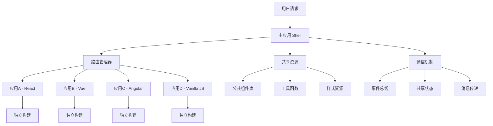

# 微前端核心概念与架构

## 核心概念

### 什么是微前端？

微前端是一种将多个可独立开发、独立部署的前端应用聚合为一个整体应用的架构模式。

```
传统前端架构：
┌─────────────────────────────────┐
│          单体前端应用            │
│  ┌─────┐ ┌─────┐ ┌─────┐ ┌─────┐ │
│  │模块A│ │模块B│ │模块C│ │模块D│ │
│  └─────┘ └─────┘ └─────┘ └─────┘ │
└─────────────────────────────────┘

微前端架构：
┌─────────────────────────────────┐
│            主应用               │
│  ┌─────┐ ┌─────┐ ┌─────┐ ┌─────┐ │
│  │应用A│ │应用B│ │应用C│ │应用D│ │
│  │独立 │ │独立 │ │独立 │ │独立 │ │
│  │部署│ │部署│ │部署│ │部署│ │
│  └─────┘ └─────┘ └─────┘ └─────┘ │
└─────────────────────────────────┘
```

### 核心特征

1. **技术栈无关**：各子应用可使用不同技术栈
2. **独立开发**：团队可独立开发各自负责的应用
3. **独立部署**：子应用可独立发布，无需整体重新部署
4. **增量升级**：可渐进式迁移和升级
5. **运行时集成**：通过运行时动态加载子应用

### 微前端 vs 微服务

| 特征 | 微服务 | 微前端 |
|------|--------|--------|
| 拆分维度 | 后端服务 | 前端应用 |
| 独立性 | 数据库+服务 | UI+业务逻辑 |
| 通信方式 | HTTP/RPC | 事件/消息 |
| 部署单位 | 服务实例 | 前端应用 |
| 技术栈 | 多语言 | 多框架 |

## 架构设计

### 整体架构图



### 核心组件

#### 1. 主应用（Shell/Base App）

主应用负责：
- **路由管理**：控制子应用的加载和卸载
- **应用注册**：管理所有子应用的生命周期
- **公共资源**：提供共享的组件、工具和样式
- **通信中枢**：协调子应用间的数据交换

```javascript
// 主应用架构示例
class MainApp {
  constructor() {
    this.apps = new Map();
    this.router = new Router();
    this.communicator = new AppCommunicator();
  }
  
  // 注册子应用
  registerApp(appConfig) {
    this.apps.set(appConfig.name, appConfig);
    this.router.addRoute(appConfig.route, appConfig);
  }
  
  // 启动应用
  start() {
    this.router.start();
    this.communicator.initialize();
  }
}
```

#### 2. 子应用（Micro Apps）

子应用特点：
- **业务独立**：包含完整的业务功能
- **技术自主**：可选择任意技术栈
- **生命周期**：支持 bootstrap、mount、unmount
- **沙箱隔离**：与其他应用隔离运行

```javascript
// 子应用生命周期
export async function bootstrap() {
  console.log('应用初始化');
}

export async function mount(props) {
  console.log('应用挂载', props);
  // 渲染应用
}

export async function unmount(props) {
  console.log('应用卸载', props);
  // 清理资源
}
```

#### 3. 应用注册中心

```javascript
// 应用注册中心
class AppRegistry {
  constructor() {
    this.registry = new Map();
  }
  
  // 注册应用
  register(app) {
    this.registry.set(app.name, {
      ...app,
      status: 'registered',
      instance: null,
    });
  }
  
  // 获取应用信息
  getApp(name) {
    return this.registry.get(name);
  }
  
  // 获取所有应用
  getAllApps() {
    return Array.from(this.registry.values());
  }
  
  // 更新应用状态
  updateStatus(name, status) {
    const app = this.registry.get(name);
    if (app) {
      app.status = status;
    }
  }
}
```

### 应用生命周期

```javascript
// 应用生命周期管理
class AppLifecycle {
  constructor(app) {
    this.app = app;
    this.status = 'initial';
  }
  
  // 引导阶段
  async bootstrap() {
    if (this.status !== 'initial') return;
    
    try {
      await this.app.bootstrap?.();
      this.status = 'bootstrapped';
    } catch (error) {
      this.status = 'bootstrap_error';
      throw error;
    }
  }
  
  // 挂载阶段
  async mount(props) {
    if (this.status !== 'bootstrapped') {
      await this.bootstrap();
    }
    
    try {
      await this.app.mount?.(props);
      this.status = 'mounted';
    } catch (error) {
      this.status = 'mount_error';
      throw error;
    }
  }
  
  // 卸载阶段
  async unmount(props) {
    if (this.status !== 'mounted') return;
    
    try {
      await this.app.unmount?.(props);
      this.status = 'unmounted';
    } catch (error) {
      this.status = 'unmount_error';
      throw error;
    }
  }
  
  // 更新阶段
  async update(props) {
    if (this.status !== 'mounted') return;
    
    try {
      await this.app.update?.(props);
    } catch (error) {
      console.error('应用更新失败', error);
    }
  }
}
```

## 设计模式

### 1. 组合模式

将多个子应用组合成一个完整的应用：

```javascript
// 应用组合器
class AppComposer {
  constructor() {
    this.apps = [];
    this.layout = null;
  }
  
  // 添加子应用
  addApp(app) {
    this.apps.push(app);
  }
  
  // 设置布局
  setLayout(layout) {
    this.layout = layout;
  }
  
  // 渲染组合应用
  render() {
    return this.layout.render(this.apps);
  }
}
```

### 2. 观察者模式

实现应用间的松耦合通信：

```javascript
// 事件管理器
class EventManager {
  constructor() {
    this.events = new Map();
  }
  
  // 订阅事件
  subscribe(event, callback) {
    if (!this.events.has(event)) {
      this.events.set(event, []);
    }
    this.events.get(event).push(callback);
  }
  
  // 发布事件
  publish(event, data) {
    const callbacks = this.events.get(event) || [];
    callbacks.forEach(callback => callback(data));
  }
  
  // 取消订阅
  unsubscribe(event, callback) {
    const callbacks = this.events.get(event) || [];
    const index = callbacks.indexOf(callback);
    if (index > -1) {
      callbacks.splice(index, 1);
    }
  }
}
```

### 3. 策略模式

根据不同条件选择不同的加载策略：

```javascript
// 加载策略
class LoadStrategy {
  // 预加载策略
  static preload = {
    name: 'preload',
    execute: async (apps) => {
      return Promise.all(apps.map(app => app.load()));
    },
  };
  
  // 懒加载策略
  static lazy = {
    name: 'lazy',
    execute: async (app) => {
      return app.load();
    },
  };
  
  // 条件加载策略
  static conditional = {
    name: 'conditional',
    execute: async (app, condition) => {
      if (condition()) {
        return app.load();
      }
    },
  };
}

// 应用加载器
class AppLoader {
  constructor(strategy) {
    this.strategy = strategy;
  }
  
  async load(apps, ...args) {
    return this.strategy.execute(apps, ...args);
  }
  
  setStrategy(strategy) {
    this.strategy = strategy;
  }
}
```

## 架构优势

### 1. 技术栈多样性

```javascript
// 不同技术栈的应用配置
const microApps = [
  {
    name: 'legacy-app',
    tech: 'jQuery + Bootstrap',
    entry: '/legacy/',
    container: '#legacy-container',
  },
  {
    name: 'react-app',
    tech: 'React 18 + TypeScript',
    entry: '/react/',
    container: '#react-container',
  },
  {
    name: 'vue-app',
    tech: 'Vue 3 + Composition API',
    entry: '/vue/',
    container: '#vue-container',
  },
  {
    name: 'angular-app',
    tech: 'Angular 15',
    entry: '/angular/',
    container: '#angular-container',
  },
];
```

### 2. 团队独立性

```javascript
// 团队责任划分
const teamMapping = {
  'platform-team': {
    apps: ['main-shell'],
    responsibilities: ['基础架构', '公共组件', '路由管理'],
  },
  'user-team': {
    apps: ['user-management'],
    responsibilities: ['用户系统', '权限管理'],
  },
  'order-team': {
    apps: ['order-management'],
    responsibilities: ['订单系统', '支付流程'],
  },
  'product-team': {
    apps: ['product-catalog'],
    responsibilities: ['商品管理', '库存系统'],
  },
};
```

### 3. 渐进式升级

```javascript
// 升级策略配置
const upgradeStrategy = {
  phases: [
    {
      name: 'Phase 1',
      target: ['legacy-app'],
      action: 'wrap', // 包装现有应用
      timeline: '2 weeks',
    },
    {
      name: 'Phase 2', 
      target: ['user-management'],
      action: 'rewrite', // 重写为 React
      timeline: '1 month',
    },
    {
      name: 'Phase 3',
      target: ['order-management'],
      action: 'migrate', // 迁移到 Vue 3
      timeline: '6 weeks',
    },
  ],
};
```

## 架构挑战

### 1. 复杂性管理

```javascript
// 复杂性指标监控
class ComplexityMonitor {
  constructor() {
    this.metrics = {
      appCount: 0,
      communicationPaths: 0,
      sharedDependencies: 0,
      deploymentComplexity: 0,
    };
  }
  
  // 计算复杂性分数
  calculateComplexity() {
    const {
      appCount,
      communicationPaths,
      sharedDependencies,
      deploymentComplexity
    } = this.metrics;
    
    // 复杂性公式（示例）
    return (
      appCount * 1 +
      communicationPaths * 2 +
      sharedDependencies * 1.5 +
      deploymentComplexity * 3
    );
  }
  
  // 获取复杂性等级
  getComplexityLevel() {
    const score = this.calculateComplexity();
    if (score < 10) return 'Simple';
    if (score < 25) return 'Moderate';
    if (score < 50) return 'Complex';
    return 'Very Complex';
  }
}
```

### 2. 性能考量

```javascript
// 性能监控指标
const performanceMetrics = {
  // 应用加载时间
  loadTime: {
    'main-app': 150, // ms
    'react-app': 800,
    'vue-app': 600,
  },
  
  // 内存使用情况
  memoryUsage: {
    'main-app': 25, // MB
    'react-app': 45,
    'vue-app': 35,
  },
  
  // 网络请求数量
  networkRequests: {
    'main-app': 5,
    'react-app': 12,
    'vue-app': 8,
  },
};
```

### 3. 一致性保证

```javascript
// 一致性检查器
class ConsistencyChecker {
  constructor() {
    this.rules = [
      this.checkDependencyVersions,
      this.checkAPIContracts,
      this.checkUIConsistency,
    ];
  }
  
  // 检查依赖版本一致性
  checkDependencyVersions(apps) {
    const issues = [];
    const criticalDeps = ['react', 'vue', 'axios'];
    
    criticalDeps.forEach(dep => {
      const versions = apps
        .map(app => app.dependencies[dep])
        .filter(Boolean);
      
      const uniqueVersions = [...new Set(versions)];
      if (uniqueVersions.length > 1) {
        issues.push({
          type: 'dependency_mismatch',
          dependency: dep,
          versions: uniqueVersions,
        });
      }
    });
    
    return issues;
  }
  
  // 检查 API 契约
  checkAPIContracts(apps) {
    // 实现 API 契约检查逻辑
    return [];
  }
  
  // 检查 UI 一致性
  checkUIConsistency(apps) {
    // 实现 UI 一致性检查逻辑
    return [];
  }
  
  // 执行所有检查
  check(apps) {
    const allIssues = [];
    this.rules.forEach(rule => {
      const issues = rule(apps);
      allIssues.push(...issues);
    });
    return allIssues;
  }
}
```

## 总结

微前端架构为大型前端项目提供了一种有效的解决方案，通过将单体应用拆分为多个独立的微应用，实现了：

- **技术栈自由**：每个团队可以选择最适合的技术栈
- **团队自治**：各团队可以独立开发和部署
- **渐进升级**：支持遗留系统的平滑迁移
- **可扩展性**：便于系统的水平扩展

但同时也带来了架构复杂性、性能考量、一致性保证等挑战，需要在实施过程中仔细权衡和设计。

---

**下一步**：了解具体的 [技术实现方案](./02-技术实现方案.md)
