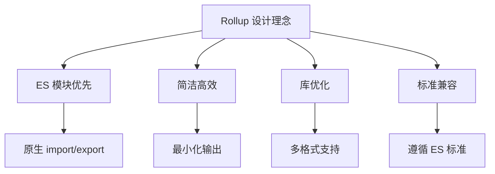

# Rollup 详解

> Rollup 是一个专为 ES 模块设计的模块打包器，专注于生产高效、简洁的代码包，特别适合库和组件的构建。

## 📚 核心概念

### 什么是 Rollup
Rollup 是下一代 ES 模块打包器，具有以下特点：
- **ES 模块优先**：原生支持 ES6 模块语法
- **Tree Shaking**：领先的无用代码消除
- **简洁输出**：生成干净、可读的代码
- **多种格式**：支持 UMD、CommonJS、ES 模块等

### 设计理念


## 🚀 快速开始

### 安装
```bash
# 全局安装
npm install -g rollup

# 项目安装
npm install --save-dev rollup

# 使用 pnpm
pnpm add -D rollup
```

### 基础使用
```bash
# 基础命令
rollup src/main.js -o bundle.js -f cjs

# 使用配置文件
rollup -c

# 监视模式
rollup -c -w
```

### 项目结构
```
my-rollup-project/
├── rollup.config.js    # 配置文件
├── package.json
├── src/
│   ├── main.js         # 入口文件
│   ├── utils.js
│   └── components/
└── dist/              # 输出目录
```

## ⚙️ 配置详解

### 基础配置
```javascript
// rollup.config.js
export default {
  input: 'src/main.js',
  output: {
    file: 'bundle.js',
    format: 'cjs'
  }
};
```

### 完整配置
```javascript
import resolve from '@rollup/plugin-node-resolve';
import commonjs from '@rollup/plugin-commonjs';
import babel from '@rollup/plugin-babel';
import terser from '@rollup/plugin-terser';
import { defineConfig } from 'rollup';

export default defineConfig({
  input: 'src/main.js',
  
  output: [
    {
      file: 'dist/bundle.cjs.js',
      format: 'cjs',
      exports: 'named'
    },
    {
      file: 'dist/bundle.esm.js',
      format: 'es'
    },
    {
      file: 'dist/bundle.umd.js',
      format: 'umd',
      name: 'MyLibrary',
      globals: {
        'react': 'React',
        'react-dom': 'ReactDOM'
      }
    }
  ],
  
  external: ['react', 'react-dom'],
  
  plugins: [
    resolve({
      browser: true,
      preferBuiltins: false
    }),
    commonjs(),
    babel({
      babelHelpers: 'bundled',
      exclude: 'node_modules/**'
    }),
    terser()
  ]
});
```

### 多入口配置
```javascript
export default [
  // 主包
  {
    input: 'src/main.js',
    output: {
      file: 'dist/main.js',
      format: 'es'
    }
  },
  // 工具包
  {
    input: 'src/utils.js',
    output: {
      file: 'dist/utils.js',
      format: 'es'
    }
  },
  // 完整包
  {
    input: {
      main: 'src/main.js',
      utils: 'src/utils.js'
    },
    output: {
      dir: 'dist',
      format: 'es'
    }
  }
];
```

## 🔌 插件生态

### 官方核心插件
```javascript
import resolve from '@rollup/plugin-node-resolve';
import commonjs from '@rollup/plugin-commonjs';
import json from '@rollup/plugin-json';
import babel from '@rollup/plugin-babel';
import typescript from '@rollup/plugin-typescript';
import terser from '@rollup/plugin-terser';

export default {
  plugins: [
    // 解析 node_modules 中的模块
    resolve({
      browser: true,
      preferBuiltins: false,
      exportConditions: ['import', 'module', 'default']
    }),
    
    // CommonJS 转换
    commonjs({
      include: 'node_modules/**'
    }),
    
    // JSON 文件支持
    json(),
    
    // Babel 转译
    babel({
      babelHelpers: 'bundled',
      exclude: 'node_modules/**',
      presets: [
        ['@babel/preset-env', {
          modules: false,
          targets: '> 0.25%, not dead'
        }]
      ]
    }),
    
    // TypeScript 支持
    typescript({
      tsconfig: './tsconfig.json',
      declaration: true,
      declarationDir: 'dist/types'
    }),
    
    // 代码压缩
    terser({
      compress: {
        drop_console: true
      }
    })
  ]
};
```

### 常用社区插件
```javascript
import postcss from 'rollup-plugin-postcss';
import vue from 'rollup-plugin-vue';
import alias from '@rollup/plugin-alias';
import replace from '@rollup/plugin-replace';
import { visualizer } from 'rollup-plugin-visualizer';
import copy from 'rollup-plugin-copy';

export default {
  plugins: [
    // 路径别名
    alias({
      entries: [
        { find: '@', replacement: path.resolve(__dirname, 'src') }
      ]
    }),
    
    // 环境变量替换
    replace({
      preventAssignment: true,
      'process.env.NODE_ENV': JSON.stringify('production')
    }),
    
    // CSS 处理
    postcss({
      extract: true,
      minimize: true,
      use: ['sass']
    }),
    
    // Vue 单文件组件
    vue({
      target: 'browser',
      css: false
    }),
    
    // 文件复制
    copy({
      targets: [
        { src: 'src/assets/*', dest: 'dist/assets' }
      ]
    }),
    
    // 包分析
    visualizer({
      filename: 'dist/stats.html',
      open: true
    })
  ]
};
```

## 📦 输出格式

### ES 模块 (ESM)
```javascript
export default {
  output: {
    file: 'dist/bundle.esm.js',
    format: 'es',
    exports: 'named'
  }
};

// 输出示例
export { add, subtract };
export default calculator;
```

### CommonJS (CJS)
```javascript
export default {
  output: {
    file: 'dist/bundle.cjs.js',
    format: 'cjs',
    exports: 'named'
  }
};

// 输出示例
exports.add = add;
exports.subtract = subtract;
module.exports = calculator;
```

### UMD (Universal Module Definition)
```javascript
export default {
  output: {
    file: 'dist/bundle.umd.js',
    format: 'umd',
    name: 'MyLibrary',
    globals: {
      'lodash': '_'
    }
  },
  external: ['lodash']
};
```

### IIFE (立即执行函数)
```javascript
export default {
  output: {
    file: 'dist/bundle.iife.js',
    format: 'iife',
    name: 'MyLibrary'
  }
};
```

## 🎯 库开发最佳实践

### 包配置文件
```json
{
  "name": "my-awesome-lib",
  "version": "1.0.0",
  "type": "module",
  "main": "./dist/index.cjs.js",
  "module": "./dist/index.esm.js",
  "exports": {
    ".": {
      "import": "./dist/index.esm.js",
      "require": "./dist/index.cjs.js",
      "types": "./dist/index.d.ts"
    },
    "./utils": {
      "import": "./dist/utils.esm.js",
      "require": "./dist/utils.cjs.js"
    }
  },
  "types": "./dist/index.d.ts",
  "files": [
    "dist"
  ],
  "sideEffects": false
}
```

### TypeScript 库配置
```javascript
// rollup.config.js
import typescript from '@rollup/plugin-typescript';
import dts from 'rollup-plugin-dts';

const config = [
  // 构建 JS
  {
    input: 'src/index.ts',
    output: [
      {
        file: 'dist/index.cjs.js',
        format: 'cjs',
        sourcemap: true
      },
      {
        file: 'dist/index.esm.js',
        format: 'es',
        sourcemap: true
      }
    ],
    plugins: [
      typescript({
        tsconfig: './tsconfig.json'
      })
    ]
  },
  // 构建类型定义
  {
    input: 'src/index.ts',
    output: {
      file: 'dist/index.d.ts',
      format: 'es'
    },
    plugins: [dts()]
  }
];

export default config;
```

### 外部依赖管理
```javascript
// 自动标记 peerDependencies 为外部依赖
import { createRequire } from 'module';
const require = createRequire(import.meta.url);
const pkg = require('./package.json');

export default {
  external: [
    ...Object.keys(pkg.peerDependencies || {}),
    ...Object.keys(pkg.dependencies || {}),
    'react/jsx-runtime'
  ]
};
```

## 🛠️ 开发工具集成

### 监视模式
```javascript
// rollup.config.js
export default {
  watch: {
    include: 'src/**',
    exclude: 'node_modules/**',
    clearScreen: false
  }
};
```

```bash
# 命令行监视
rollup -c -w

# 指定配置文件
rollup -c rollup.config.dev.js -w
```

### 开发服务器
```javascript
import serve from 'rollup-plugin-serve';
import livereload from 'rollup-plugin-livereload';

export default {
  plugins: [
    // 开发服务器
    serve({
      open: true,
      contentBase: ['dist', 'public'],
      port: 3000
    }),
    
    // 热重载
    livereload('dist')
  ]
};
```

### 环境区分
```javascript
// rollup.config.js
const production = !process.env.ROLLUP_WATCH;

export default {
  output: {
    sourcemap: !production
  },
  plugins: [
    // 开发环境插件
    !production && serve(),
    !production && livereload(),
    
    // 生产环境插件
    production && terser()
  ].filter(Boolean)
};
```

## 🚀 性能优化

### Tree Shaking 优化
```javascript
// 确保代码支持 Tree Shaking
export { add } from './math.js';
export { format } from './string.js';

// 避免副作用
// ❌ 不推荐
import './global-styles.css';
console.log('Module loaded');

// ✅ 推荐
export function setupGlobalStyles() {
  import('./global-styles.css');
}
```

### 代码分割
```javascript
export default {
  input: ['src/main.js', 'src/worker.js'],
  output: {
    dir: 'dist',
    format: 'es',
    chunkFileNames: '[name]-[hash].js'
  },
  manualChunks: {
    vendor: ['lodash', 'moment'],
    utils: ['src/utils/index.js']
  }
};
```

### 输出优化
```javascript
export default {
  output: {
    // 紧凑输出
    compact: true,
    
    // 最小化空格
    indent: false,
    
    // 优化导出
    exports: 'named',
    
    // 源码映射
    sourcemap: true,
    sourcemapExcludeSources: true
  }
};
```

## 🧪 测试集成

### 配置测试环境
```javascript
// rollup.config.test.js
export default {
  input: 'src/index.js',
  output: {
    file: 'test/bundle.js',
    format: 'cjs'
  },
  external: ['assert', 'fs', 'path']
};
```

### 测试脚本
```json
{
  "scripts": {
    "test": "rollup -c rollup.config.test.js && node test/bundle.js",
    "test:watch": "rollup -c rollup.config.test.js -w"
  }
}
```

## 🔧 高级配置

### 自定义插件
```javascript
// plugins/custom-plugin.js
export default function customPlugin(options = {}) {
  return {
    name: 'custom-plugin',
    
    // 构建开始
    buildStart(opts) {
      console.log('Build started');
    },
    
    // 解析模块
    resolveId(id, importer) {
      if (id === 'virtual:my-module') {
        return id;
      }
    },
    
    // 加载模块
    load(id) {
      if (id === 'virtual:my-module') {
        return 'export const msg = "Hello from virtual module"';
      }
    },
    
    // 转换代码
    transform(code, id) {
      if (id.endsWith('.special')) {
        return `export default ${JSON.stringify(code)}`;
      }
    },
    
    // 生成包
    generateBundle(options, bundle) {
      // 添加额外文件
      this.emitFile({
        type: 'asset',
        fileName: 'version.txt',
        source: '1.0.0'
      });
    }
  };
}
```

### 条件构建
```javascript
// 根据环境变量配置
export default (commandLineArgs) => {
  const isProduction = commandLineArgs.environment === 'production';
  
  return {
    input: 'src/index.js',
    output: {
      file: isProduction ? 'dist/bundle.min.js' : 'dist/bundle.js',
      format: 'umd',
      name: 'MyLib'
    },
    plugins: [
      resolve(),
      commonjs(),
      isProduction && terser()
    ].filter(Boolean)
  };
};
```

### 动态配置
```javascript
// 配置工厂函数
export default function createConfig(format) {
  return {
    input: 'src/index.js',
    output: {
      file: `dist/bundle.${format}.js`,
      format
    },
    plugins: [
      resolve(),
      commonjs()
    ]
  };
}

// 导出多个配置
export default ['es', 'cjs', 'umd'].map(createConfig);
```

## 📊 Rollup 4 新特性

### 性能提升
- **更快的解析**：优化的模块解析算法
- **改进的 Tree Shaking**：更精确的无用代码消除
- **并行处理**：更好的多核心利用

### 新特性
```javascript
// 新的配置选项
export default {
  // 实验性特性
  experimentalMinChunkSize: 1000,
  
  // 改进的外部化
  external: (id, parentId, isResolved) => {
    return id.startsWith('node:');
  },
  
  // 新的插件钩子
  plugins: [
    {
      name: 'my-plugin',
      moduleParsed(info) {
        // 模块解析完成后调用
      }
    }
  ]
};
```

### ESM 优化
```javascript
export default {
  output: {
    format: 'es',
    // 保持动态导入
    dynamicImportInCjs: false,
    // 优化导出
    exports: 'auto'
  }
};
```

## 🎯 实际项目示例

### React 组件库
```javascript
// rollup.config.js
import resolve from '@rollup/plugin-node-resolve';
import commonjs from '@rollup/plugin-commonjs';
import babel from '@rollup/plugin-babel';
import peerDepsExternal from 'rollup-plugin-peer-deps-external';
import postcss from 'rollup-plugin-postcss';

export default {
  input: 'src/index.js',
  output: [
    {
      file: 'dist/index.cjs.js',
      format: 'cjs',
      sourcemap: true
    },
    {
      file: 'dist/index.esm.js',
      format: 'es',
      sourcemap: true
    }
  ],
  plugins: [
    peerDepsExternal(),
    resolve({
      browser: true
    }),
    commonjs(),
    babel({
      babelHelpers: 'bundled',
      exclude: 'node_modules/**',
      presets: ['@babel/preset-react']
    }),
    postcss({
      extract: true,
      minimize: true
    })
  ]
};
```

### Vue 组件库
```javascript
import vue from 'rollup-plugin-vue';
import css from 'rollup-plugin-css-only';

export default {
  input: 'src/index.js',
  output: {
    file: 'dist/my-vue-lib.js',
    format: 'es'
  },
  external: ['vue'],
  plugins: [
    vue({
      css: false
    }),
    css({
      output: 'dist/style.css'
    })
  ]
};
```

### 工具库
```javascript
export default {
  input: 'src/index.js',
  output: [
    {
      file: 'dist/utils.cjs.js',
      format: 'cjs'
    },
    {
      file: 'dist/utils.esm.js',
      format: 'es'
    },
    {
      file: 'dist/utils.umd.js',
      format: 'umd',
      name: 'Utils'
    }
  ],
  plugins: [
    babel({
      babelHelpers: 'bundled'
    }),
    terser()
  ]
};
```

## 🚨 常见问题

### 1. 循环依赖
```javascript
// 检测循环依赖
export default {
  onwarn(warning, warn) {
    if (warning.code === 'CIRCULAR_DEPENDENCY') {
      console.warn('发现循环依赖:', warning.message);
    }
    warn(warning);
  }
};
```

### 2. 外部依赖问题
```javascript
// 正确配置外部依赖
export default {
  external: (id) => {
    // 排除所有 node_modules
    return /node_modules/.test(id);
  }
};
```

### 3. CommonJS 兼容性
```javascript
import commonjs from '@rollup/plugin-commonjs';

export default {
  plugins: [
    commonjs({
      // 显式包含需要转换的模块
      include: ['node_modules/**'],
      // 处理混合模块
      requireReturnsDefault: 'auto'
    })
  ]
};
```

---

> **总结**：Rollup 是构建库和组件的理想选择，提供优秀的 Tree Shaking 和简洁的输出，特别适合现代 ES 模块项目和库开发。
