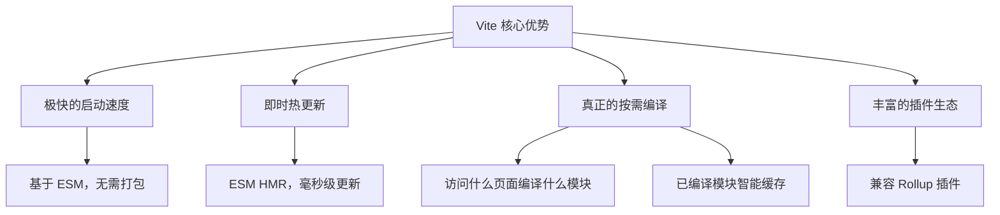

# Vite 详解

> Vite 是一个快速的前端构建工具，基于 ESM 和 Rollup，提供极快的开发体验和优化的生产构建。

## 📚 核心概念

### 什么是 Vite
Vite（法语意为"快速"）是新一代前端构建工具，具有以下特点：
- **开发时**：基于 ESM 的快速热更新
- **构建时**：使用 Rollup 进行优化打包
- **零配置**：开箱即用，约定大于配置

### 核心优势


### 按需编译的革命性机制
Vite 最核心的性能优势来自于其按需编译策略：

#### 传统构建工具的工作流程
```bash
# webpack 等传统工具
启动阶段：
1. 分析所有入口文件
2. 递归构建完整依赖图
3. 编译所有发现的模块
4. 启动开发服务器
时间：60-90秒（大型项目）
```

#### Vite 的按需编译流程
```bash
# Vite 的智能策略
启动阶段：
1. 启动开发服务器（2秒）
2. 预构建依赖包（esbuild）
3. 等待页面请求

运行阶段：
用户访问 /home → 编译 Home.vue + 相关组件
用户访问 /profile → 编译 Profile.vue + 新增模块
用户访问 /admin → 编译 Admin.vue + 管理组件
```

#### 具体性能表现
```javascript
// 大型项目实测数据（1000+ 组件）
const 性能对比 = {
  webpack: {
    启动时间: '90秒',
    原因: '需要编译所有模块才能启动'
  },
  
  Vite: {
    启动时间: '3秒',
    首页渲染: '1秒',
    原因: '只编译当前访问的页面模块'
  },
  
  // 如果项目有10个页面，用户只访问首页
  webpack: '仍需要90秒，编译了9个用不到的页面',
  Vite: '只需要4秒，只编译首页相关模块'
}
```

## 🚀 快速开始

### 创建项目
```bash
# npm
npm create vite@latest my-vue-app -- --template vue
npm create vite@latest my-react-app -- --template react
npm create vite@latest my-vanilla-app -- --template vanilla

# yarn
yarn create vite my-vue-app --template vue

# pnpm
pnpm create vite my-react-app --template react

# 支持的模板
# vanilla, vanilla-ts
# vue, vue-ts
# react, react-ts, react-swc, react-swc-ts
# preact, preact-ts
# lit, lit-ts
# svelte, svelte-ts
# solid, solid-ts
# qwik, qwik-ts
```

### 项目结构
```
my-vite-app/
├── index.html          # 入口 HTML 文件
├── vite.config.js      # Vite 配置文件
├── package.json
├── src/
│   ├── main.js         # 应用入口
│   ├── App.vue
│   └── components/
└── public/            # 静态资源目录
    └── favicon.ico
```

## ⚙️ 配置详解

### 基础配置
```javascript
// vite.config.js
import { defineConfig } from 'vite'
import vue from '@vitejs/plugin-vue'
import { resolve } from 'path'

export default defineConfig({
  // 插件配置
  plugins: [vue()],
  
  // 开发服务器配置
  server: {
    port: 3000,
    host: true,
    open: true,
    cors: true,
    proxy: {
      '/api': {
        target: 'http://localhost:8080',
        changeOrigin: true,
        rewrite: (path) => path.replace(/^\/api/, '')
      }
    }
  },
  
  // 构建配置
  build: {
    target: 'es2015',
    outDir: 'dist',
    assetsDir: 'assets',
    sourcemap: true,
    minify: 'terser',
    terserOptions: {
      compress: {
        drop_console: true,
        drop_debugger: true
      }
    },
    rollupOptions: {
      input: {
        main: resolve(__dirname, 'index.html'),
        admin: resolve(__dirname, 'admin.html')
      }
    }
  },
  
  // 路径解析
  resolve: {
    alias: {
      '@': resolve(__dirname, 'src'),
      '@components': resolve(__dirname, 'src/components'),
      '@utils': resolve(__dirname, 'src/utils')
    }
  },
  
  // CSS 配置
  css: {
    preprocessorOptions: {
      scss: {
        additionalData: `@import "@/styles/variables.scss";`
      }
    },
    modules: {
      localsConvention: 'camelCase'
    }
  },
  
  // 环境变量
  define: {
    __APP_VERSION__: JSON.stringify('1.0.0'),
    __API_URL__: JSON.stringify(process.env.API_URL)
  }
})
```

### 条件配置
```javascript
import { defineConfig } from 'vite'

export default defineConfig(({ command, mode }) => {
  const isProduction = mode === 'production'
  
  return {
    plugins: [
      // 插件配置
    ],
    define: {
      __DEV__: !isProduction
    },
    server: {
      // 开发服务器配置
      hmr: command === 'serve'
    },
    build: {
      minify: isProduction ? 'terser' : false,
      sourcemap: !isProduction
    }
  }
})
```

## 🔌 插件生态

### 官方插件
```javascript
import { defineConfig } from 'vite'
import vue from '@vitejs/plugin-vue'
import react from '@vitejs/plugin-react'
import { svelte } from '@sveltejs/vite-plugin-svelte'

export default defineConfig({
  plugins: [
    // Vue 支持
    vue({
      template: {
        compilerOptions: {
          isCustomElement: (tag) => tag.startsWith('my-')
        }
      }
    }),
    
    // React 支持
    react({
      jsxRuntime: 'automatic',
      babel: {
        plugins: ['babel-plugin-styled-components']
      }
    }),
    
    // Svelte 支持
    svelte()
  ]
})
```

### 社区插件
```javascript
import { defineConfig } from 'vite'
import { resolve } from 'path'
import legacy from '@vitejs/plugin-legacy'
import { createHtmlPlugin } from 'vite-plugin-html'
import { visualizer } from 'rollup-plugin-visualizer'
import { defineConfig } from 'vitest/config'

export default defineConfig({
  plugins: [
    // 传统浏览器兼容
    legacy({
      targets: ['defaults', 'not IE 11']
    }),
    
    // HTML 模板
    createHtmlPlugin({
      minify: true,
      entry: 'src/main.js',
      template: 'public/index.html',
      inject: {
        data: {
          title: 'My App'
        }
      }
    }),
    
    // 包分析
    visualizer({
      filename: 'dist/stats.html',
      open: true,
      gzipSize: true
    }),
    
    // Mock 服务
    {
      name: 'mock',
      configureServer(server) {
        server.middlewares.use('/api', mockMiddleware)
      }
    }
  ]
})
```

### TypeScript 支持
```javascript
// vite.config.ts
import { defineConfig } from 'vite'
import vue from '@vitejs/plugin-vue'
import checker from 'vite-plugin-checker'

export default defineConfig({
  plugins: [
    vue(),
    // TypeScript 类型检查
    checker({
      typescript: true,
      vueTsc: true,
      eslint: {
        lintCommand: 'eslint "./src/**/*.{ts,tsx}"'
      }
    })
  ],
  
  esbuild: {
    target: 'es2022'
  }
})
```

## 🎯 开发体验

### 热模块替换（HMR）
```javascript
// main.js
if (import.meta.hot) {
  // HMR API
  import.meta.hot.accept('./App.vue', (newModule) => {
    // 处理模块更新
  })
  
  import.meta.hot.dispose(() => {
    // 清理副作用
  })
  
  // 自定义事件
  import.meta.hot.on('custom:reload', () => {
    location.reload()
  })
}
```

### 环境变量
```bash
# .env
VITE_APP_TITLE=My App
VITE_API_URL=https://api.example.com

# .env.local
VITE_SECRET_KEY=abc123

# .env.development
VITE_API_URL=http://localhost:3000

# .env.production
VITE_API_URL=https://prod-api.example.com
```

```javascript
// 使用环境变量
console.log(import.meta.env.VITE_APP_TITLE)
console.log(import.meta.env.MODE) // 'development' | 'production'
console.log(import.meta.env.DEV)  // boolean
console.log(import.meta.env.PROD) // boolean
```

### 静态资源处理
```javascript
// 导入静态资源
import imgUrl from './img.png'
import txtContent from './data.txt?raw'
import workerScript from './worker.js?worker'
import inlineWorker from './worker.js?worker&inline'

// 动态导入
const imgUrl = new URL('./img.png', import.meta.url).href

// public 目录
// /public/icon.svg -> /icon.svg
```

## 🏗️ 构建优化

### 代码分割
```javascript
// vite.config.js
export default defineConfig({
  build: {
    rollupOptions: {
      output: {
        manualChunks: {
          // 第三方库分包
          vendor: ['vue', 'vue-router', 'vuex'],
          utils: ['lodash', 'axios'],
          ui: ['element-plus']
        },
        // 或使用函数
        manualChunks(id) {
          if (id.includes('node_modules')) {
            return 'vendor'
          }
        }
      }
    }
  }
})
```

### Tree Shaking
```javascript
// 确保 package.json 配置
{
  "sideEffects": [
    "*.css",
    "*.scss",
    "./src/polyfills.js"
  ]
}

// 使用 ES 模块导入
import { debounce } from 'lodash-es'
import { Button } from 'antd'
```

### 动态导入
```javascript
// 路由懒加载
const Home = () => import('./views/Home.vue')
const About = () => import('./views/About.vue')

// 组件懒加载
const LazyComponent = defineAsyncComponent(() => import('./Heavy.vue'))

// 条件加载
async function loadFeature() {
  if (shouldLoadFeature) {
    const { feature } = await import('./feature.js')
    feature.init()
  }
}
```

## 🧪 测试集成

### Vitest 配置
```javascript
// vite.config.js
import { defineConfig } from 'vitest/config'

export default defineConfig({
  test: {
    globals: true,
    environment: 'jsdom',
    setupFiles: ['./src/test/setup.ts']
  }
})
```

```javascript
// src/test/setup.ts
import { expect, afterEach } from 'vitest'
import { cleanup } from '@testing-library/vue'
import * as matchers from '@testing-library/jest-dom/matchers'

expect.extend(matchers)

afterEach(() => {
  cleanup()
})
```

### 测试示例
```javascript
// Button.test.js
import { render, screen } from '@testing-library/vue'
import { expect, test } from 'vitest'
import Button from './Button.vue'

test('renders button with text', () => {
  render(Button, { props: { text: 'Click me' } })
  expect(screen.getByRole('button')).toHaveTextContent('Click me')
})
```

## 📱 移动端优化

### PWA 支持
```javascript
import { defineConfig } from 'vite'
import { VitePWA } from 'vite-plugin-pwa'

export default defineConfig({
  plugins: [
    VitePWA({
      registerType: 'autoUpdate',
      workbox: {
        clientsClaim: true,
        skipWaiting: true
      },
      manifest: {
        name: 'My App',
        short_name: 'MyApp',
        description: 'My Awesome App description',
        theme_color: '#ffffff',
        icons: [
          {
            src: 'pwa-192x192.png',
            sizes: '192x192',
            type: 'image/png'
          }
        ]
      }
    })
  ]
})
```

### 移动端适配
```javascript
import { defineConfig } from 'vite'
import postcssPresetEnv from 'postcss-preset-env'
import postcssPxToViewport from 'postcss-px-to-viewport'

export default defineConfig({
  css: {
    postcss: {
      plugins: [
        postcssPresetEnv(),
        postcssPxToViewport({
          viewportWidth: 375,
          viewportHeight: 667,
          unitPrecision: 3,
          viewportUnit: 'vw',
          selectorBlackList: ['.ignore'],
          minPixelValue: 1,
          mediaQuery: false
        })
      ]
    }
  }
})
```

## ⚡ 性能优化

### 预加载策略
```javascript
// vite.config.js
export default defineConfig({
  build: {
    rollupOptions: {
      output: {
        experimentalMinChunkSize: 20000 // 最小块大小
      }
    }
  }
})
```

```html
<!-- 在 index.html 中预加载 -->
<link rel="modulepreload" href="/src/main.js">
<link rel="prefetch" href="/src/components/HeavyComponent.vue">
```

### 构建分析
```javascript
import { defineConfig } from 'vite'
import { bundle } from 'vite-plugin-bundle-analyzer'

export default defineConfig({
  plugins: [
    bundle({
      analyzerMode: 'static',
      openAnalyzer: false,
      reportFilename: 'bundle-report.html'
    })
  ]
})
```

### 缓存策略
```javascript
export default defineConfig({
  build: {
    rollupOptions: {
      output: {
        // 文件名哈希
        entryFileNames: 'assets/[name].[hash].js',
        chunkFileNames: 'assets/[name].[hash].js',
        assetFileNames: 'assets/[name].[hash].[ext]'
      }
    }
  }
})
```

## 🔧 高级功能

### 自定义插件
```javascript
// plugins/my-plugin.js
function myPlugin(options = {}) {
  return {
    name: 'my-plugin',
    buildStart() {
      console.log('构建开始')
    },
    transform(code, id) {
      if (id.endsWith('.special')) {
        return `export default ${JSON.stringify(code)}`
      }
    },
    generateBundle(options, bundle) {
      // 生成额外文件
      this.emitFile({
        type: 'asset',
        fileName: 'manifest.json',
        source: JSON.stringify({ version: '1.0.0' })
      })
    }
  }
}

export default myPlugin
```

### 多页面应用
```javascript
// vite.config.js
import { resolve } from 'path'

export default defineConfig({
  build: {
    rollupOptions: {
      input: {
        main: resolve(__dirname, 'index.html'),
        admin: resolve(__dirname, 'admin/index.html'),
        mobile: resolve(__dirname, 'mobile/index.html')
      }
    }
  }
})
```

### SSR 支持
```javascript
// vite.config.js
export default defineConfig({
  build: {
    ssr: true
  },
  ssr: {
    noExternal: ['element-plus']
  }
})
```

## 📊 Vite 5 新特性

### 性能提升
- **Rollup 4**：更快的构建速度
- **优化的 HMR**：更精确的热更新
- **改进的预构建**：更好的依赖处理

### 新 API
```javascript
// 新的环境 API
export default defineConfig({
  environments: {
    client: {
      build: {
        outDir: 'dist/client'
      }
    },
    ssr: {
      build: {
        outDir: 'dist/server',
        ssr: true
      }
    }
  }
})
```

### 改进的插件系统
```javascript
// 环境特定插件
function myPlugin() {
  return {
    name: 'my-plugin',
    config(config, { command }) {
      if (command === 'serve') {
        // 开发环境特定配置
      }
    }
  }
}
```

## 🎯 最佳实践

### 1. 配置组织
```javascript
// configs/vite.base.js
export const baseConfig = {
  resolve: {
    alias: {
      '@': resolve(__dirname, '../src')
    }
  }
}

// configs/vite.dev.js
export const devConfig = {
  server: {
    port: 3000
  }
}

// configs/vite.prod.js
export const prodConfig = {
  build: {
    minify: 'terser'
  }
}
```

### 2. 性能监控
```javascript
// 构建时间分析
import { defineConfig } from 'vite'

const startTime = Date.now()

export default defineConfig({
  plugins: [
    {
      name: 'build-timer',
      buildStart() {
        console.log('构建开始...')
      },
      buildEnd() {
        console.log(`构建完成，耗时: ${Date.now() - startTime}ms`)
      }
    }
  ]
})
```

### 3. 错误处理
```javascript
export default defineConfig({
  build: {
    rollupOptions: {
      onwarn(warning, warn) {
        // 忽略特定警告
        if (warning.code === 'UNUSED_EXTERNAL_IMPORT') return
        warn(warning)
      }
    }
  }
})
```

## 🚨 常见问题

### 1. ESM 兼容性
```javascript
// 处理 CommonJS 模块
export default defineConfig({
  optimizeDeps: {
    include: ['legacy-package'],
    exclude: ['local-package']
  }
})
```

### 2. 路径解析问题
```javascript
// 确保路径别名正确
export default defineConfig({
  resolve: {
    alias: {
      '@': path.resolve(__dirname, 'src'),
      '~': path.resolve(__dirname, 'node_modules')
    }
  }
})
```

### 3. CSS 处理问题
```javascript
export default defineConfig({
  css: {
    devSourcemap: true,
    preprocessorOptions: {
      scss: {
        charset: false
      }
    }
  }
})
```

---

> **总结**：Vite 是现代前端开发的首选工具，提供极快的开发体验和优化的生产构建，特别适合现代框架和 ESM 项目。
