# 构建工具核心思想与设计理念对比

> 深入解析 webpack、Vite、Rollup 三大构建工具的设计思想、核心理念和技术哲学，理解工具背后的逻辑。

## 📚 相关文档

- [webpack 详解](./webpack详解.md) - 万能型构建工具，企业级复杂应用的全能解决方案
- [Vite 详解](./Vite详解.md) - 开发体验优先，现代前端开发的革新者
- [Rollup 详解](./Rollup详解.md) - ES 模块纯粹主义者，库和组件的完美构建器

## 🧠 核心设计思想对比

### webpack：万能型工具箱思想
**设计理念**：Everything is a module（一切皆模块）

webpack 的核心思想是将项目中的所有资源（JS、CSS、图片、字体等）都视为模块，通过构建依赖图来管理和打包这些模块。

**哲学内核**：
- **统一抽象**：用模块概念统一处理所有类型的资源
- **灵活可扩展**：通过 Loader + Plugin 架构实现无限可能
- **全面覆盖**：不仅是打包工具，更是完整的工程化解决方案
- **稳定优先**：向后兼容，保证项目的长期稳定性

### Vite：体验优先思想  
**设计理念**：Developer Experience First（开发者体验优先）

Vite 的核心思想是利用现代浏览器的 ESM 能力和现代构建工具的性能，彻底改善前端开发体验。

**哲学内核**：
- **开发生产分离**：开发和生产使用不同的策略优化
- **原生 ESM**：拥抱浏览器标准，减少构建负担
- **即时反馈**：毫秒级的热更新，保持开发者的思维流畅性
- **约定优于配置**：合理的默认值，降低配置复杂度

### Rollup：简洁纯粹思想
**设计理念**：ES Module First（ES 模块优先）

Rollup 专注于 ES 模块的打包优化，追求输出代码的简洁性和执行效率。

**哲学内核**：
- **ES 标准原生**：完全基于 ES6 模块标准设计
- **输出优化**：生成最干净、最高效的代码
- **单一职责**：专注打包，不做无关的功能
- **库优化**：为库和组件开发而生的工具

## 🏗️ 技术架构深度剖析

### webpack：依赖图驱动架构
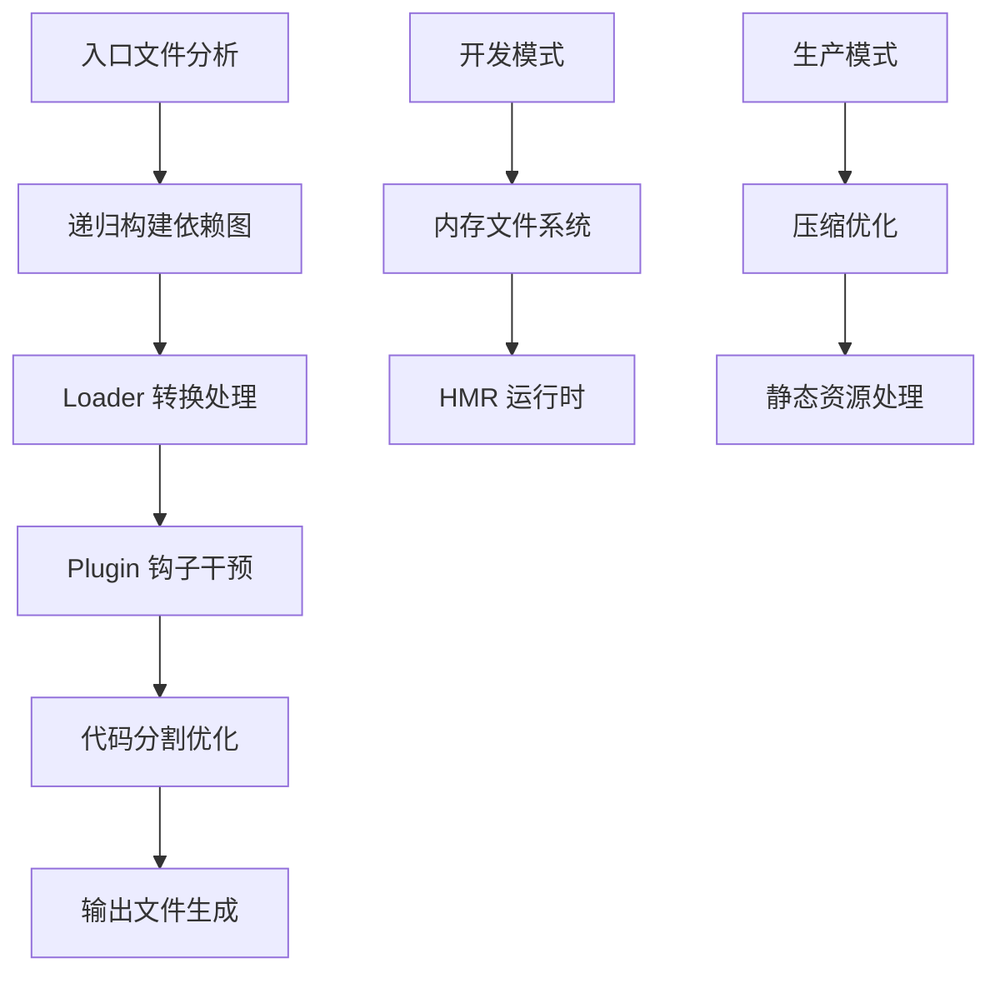

**架构思想深度解析**：

**1. 依赖图作为核心数据结构**
webpack 将整个项目抽象为一个巨大的依赖图。每个文件都是图中的一个节点，文件间的引用关系构成边。这种设计让 webpack 能够：
- 精确追踪模块依赖关系
- 实现精准的代码分割
- 支持循环依赖检测
- 提供完整的模块替换能力

**2. Loader 转换链设计**
```javascript
// webpack 的转换链思想
.vue 文件 → vue-loader → JavaScript
.scss 文件 → sass-loader → css-loader → style-loader → DOM
.ts 文件 → ts-loader → JavaScript
```
这种链式转换的设计哲学：
- **单一职责**：每个 loader 只负责一种转换
- **组合能力**：通过组合实现复杂转换
- **可测试性**：每个环节都可以独立测试

**3. Plugin 事件驱动系统**
webpack 的 Plugin 系统基于 Tapable 事件系统，提供了 100+ 个构建钩子：
```javascript
// webpack 插件钩子示例
compiler.hooks.beforeRun.tap('MyPlugin', () => {
  // 构建开始前
});
compiler.hooks.emit.tap('MyPlugin', (compilation) => {
  // 文件输出前
});
```

### Vite：双模式分离架构
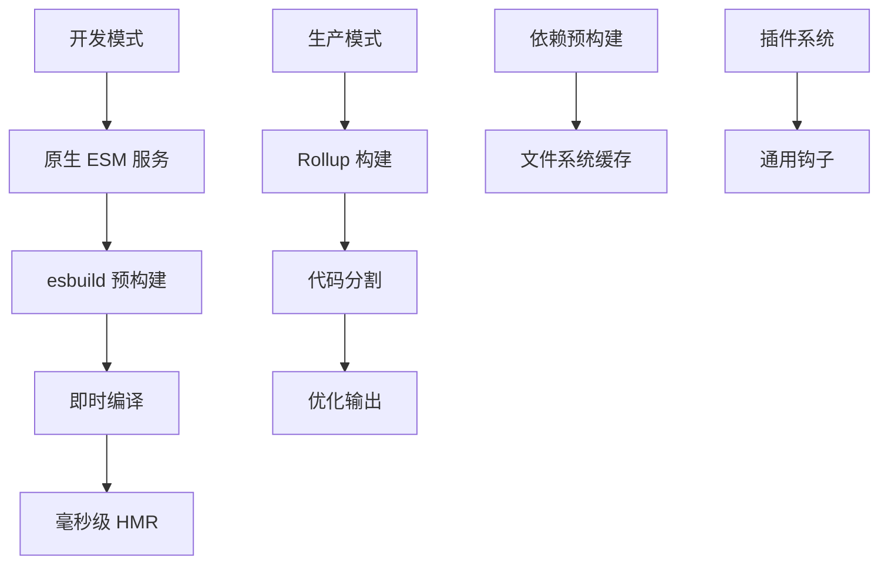

**架构思想深度解析**：

**1. 开发生产分离的双重人格**
Vite 最革命性的设计是开发和生产完全不同的构建策略：

**开发模式**：拥抱浏览器原生能力
```javascript
// 浏览器直接加载 ES 模块
import { createApp } from '/node_modules/vue/dist/vue.esm-browser.js'
import App from '/src/App.vue'  // 实时编译
```

**生产模式**：使用成熟的 Rollup 打包
```javascript
// 传统的打包输出
const bundledCode = rollup.build({
  input: 'src/main.js',
  // ... 优化配置
})
```

这种设计的深层逻辑：
- **开发优先**：开发时不需要完美的产物，只需要快速反馈
- **生产优化**：生产时需要最优化的代码，使用专业工具
- **工具专精**：让每个工具做自己最擅长的事

**2. 按需编译的革命性机制**
```javascript
// Vite 的按需编译策略
// 传统构建工具：启动时编译所有模块
webpack: 分析所有入口 → 构建完整依赖图 → 编译所有模块 → 启动（90秒）

// Vite：按需编译，用什么编译什么
Vite: 启动服务器（2秒） → 用户访问页面 → 编译当前页面模块

// 具体工作流程
用户访问 /home → 只编译 Home.vue + 相关组件
用户访问 /profile → 只编译 Profile.vue + 新增模块
已编译模块缓存，不重复编译
```

这种设计带来了质的飞跃：
- **启动速度**：不需要分析整个项目，直接启动
- **按需加载**：访问什么页面，编译什么模块
- **智能缓存**：编译过的模块长期缓存
- **网络优化**：浏览器只请求当前需要的文件

**3. 依赖预构建策略**
```javascript
// Vite 的依赖预构建思想
const deps = scanImports(entryFiles)  // 扫描依赖
const optimized = await esbuild.build({  // esbuild 预构建
  entryPoints: deps,
  bundle: true,
  format: 'esm'
})
```

这种设计解决了关键问题：
- **CommonJS 兼容**：将 CJS 模块转换为 ESM
- **依赖合并**：将多个小文件合并，减少网络请求
- **缓存优化**：预构建结果可以长期缓存

**4. 基于 ESM 的 HMR 实现**
```javascript
// Vite HMR 的精确更新
if (import.meta.hot) {
  import.meta.hot.accept('./component.vue', (newModule) => {
    // 只更新特定模块，不重载整个页面
  })
}
```

### Rollup：模块图优化架构
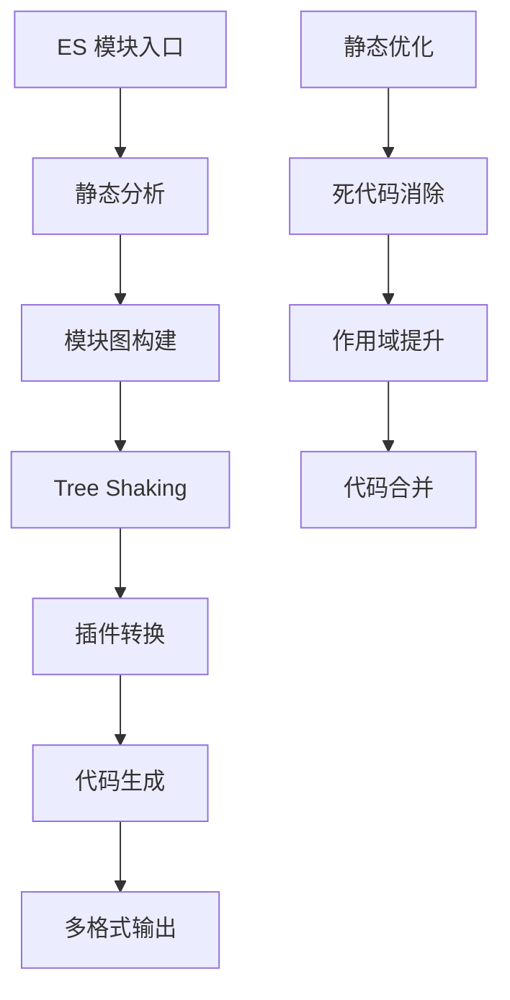

**架构思想深度解析**：

**1. 静态分析优先设计**
Rollup 完全基于 ES 模块的静态特性进行设计：
```javascript
// ES 模块的静态特性
import { used } from './utils.js'  // 编译时确定
export { something }               // 编译时确定

// 而不是动态特性
const module = require(dynamicPath)  // 运行时确定
```

这种设计带来的优势：
- **完美的 Tree Shaking**：编译时就能确定哪些代码被使用
- **作用域提升**：可以安全地合并模块作用域
- **依赖优化**：精确的依赖关系分析

**2. 插件系统的函数式设计**
```javascript
// Rollup 插件的函数式设计
export default function myPlugin(options) {
  return {
    name: 'my-plugin',
    resolveId(id) { /* 纯函数 */ },
    load(id) { /* 纯函数 */ },
    transform(code, id) { /* 纯函数 */ }
  }
}
```

这种设计哲学：
- **函数式编程**：每个钩子都是纯函数
- **可预测性**：相同输入总是产生相同输出
- **组合性**：插件可以安全地组合使用

**3. 代码生成的精确控制**
```javascript
// Rollup 对输出的精确控制
export default {
  output: {
    format: 'es',           // 精确的格式控制
    exports: 'named',       // 精确的导出控制
    interop: 'auto',        // 精确的互操作控制
    generatedCode: 'es2015' // 精确的语法控制
  }
}
```

## 🎯 核心价值主张与侧重点

### webpack：企业级工程化的全栈解决方案

**核心价值**：为复杂的大型项目提供完整的工程化解决方案

**设计侧重点**：
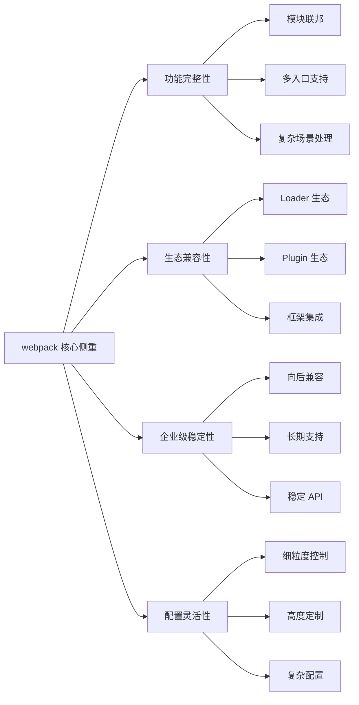

**技术哲学深度解析**：

**1. 配置即代码的理念**
webpack 认为构建配置本身就是代码，应该具备代码的所有特性：
```javascript
// webpack 配置的编程化思想
const config = {
  entry: () => getEntryPoints(),  // 动态入口
  output: {
    filename: (pathData) => {     // 动态文件名
      return pathData.chunk.name === 'main' ? '[name].js' : '[name].[contenthash].js';
    }
  },
  module: {
    rules: generateRules(env)     // 动态规则
  }
}
```

**2. 渐进式复杂度管理**
webpack 设计了从简单到复杂的渐进式学习路径：
```javascript
// 简单配置
module.exports = {
  entry: './src/index.js',
  mode: 'development'
}

// 复杂配置
module.exports = {
  entry: {
    app: './src/app.js',
    vendor: './src/vendor.js'
  },
  output: {
    path: path.resolve(__dirname, 'dist'),
    filename: '[name].[contenthash].js',
    chunkFilename: '[name].[contenthash].chunk.js',
    publicPath: process.env.NODE_ENV === 'production' ? '/assets/' : '/'
  },
  optimization: {
    splitChunks: {
      chunks: 'all',
      cacheGroups: {
        vendor: {
          test: /[\\/]node_modules[\\/]/,
          name: 'vendors',
          chunks: 'all'
        }
      }
    }
  }
}
```

**3. 企业级场景优先考虑**
- **微前端架构**：Module Federation 原生支持
- **多团队协作**：配置分离和合并机制
- **legacy 兼容**：对旧版本浏览器的完整支持
- **复杂部署**：CDN、多环境、动态加载等场景

### Vite：开发者体验革命的先锋

**核心价值**：彻底改变前端开发的反馈循环，让开发过程更加愉悦高效

**设计侧重点**：
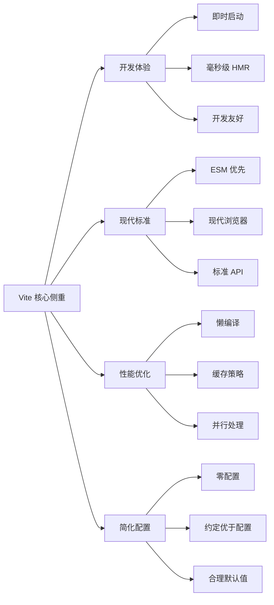

**技术哲学深度解析**：

**1. 开发体验优先的设计决策**
Vite 的每个设计决策都以开发体验为第一考虑：
```javascript
// Vite 的体验优先思想体现
// 1. 零配置启动
npm create vite@latest  // 一行命令即可开始

// 2. 开发时不打包
// 浏览器直接请求源文件，编译器实时转换
GET /src/App.vue → Vue SFC 编译器 → ES 模块

// 3. 精确的 HMR
if (import.meta.hot) {
  import.meta.hot.accept((newModule) => {
    // 仅更新当前模块，保持应用状态
  })
}
```

**2. 现代标准拥抱策略**
Vite 坚定地拥抱现代 Web 标准：
```javascript
// ESM 模块系统
import('./dynamic-module.js')  // 动态导入
import.meta.url               // 模块元信息
import.meta.env               // 环境变量

// 现代 CSS 特性
@import './style.css' assert { type: 'css' };

// Web Workers
import Worker from './worker?worker'
```

**3. 渐进增强的工具链**
```javascript
// 基础功能开箱即用
export default defineConfig({
  // 大多数项目只需要这样的配置
  plugins: [vue()]
})

// 高级功能按需启用
export default defineConfig({
  plugins: [
    vue(),
    legacy({  // 需要兼容性时才引入
      targets: ['defaults', 'not IE 11']
    })
  ]
})
```

### Rollup：ES 模块纯粹主义的完美实现

**核心价值**：为 ES 模块生态提供最优质的构建体验，专注于库和组件的最佳实践

**设计侧重点**：
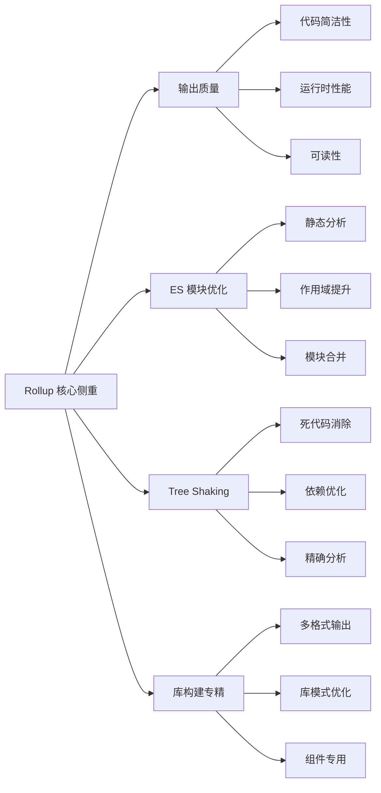

**技术哲学深度解析**：

**1. 输出质量至上的理念**
Rollup 认为构建工具的终极目标是生成最优质的代码：
```javascript
// Rollup 输出的代码示例
// 输入：多个模块文件
// 文件 a.js
export const a = 1;

// 文件 b.js  
export const b = 2;

// 文件 main.js
import { a } from './a.js';
import { b } from './b.js';
console.log(a + b);

// Rollup 输出：优化后的单文件
const a = 1;
const b = 2;
console.log(a + b);
```

**2. ES 模块静态特性的极致利用**
```javascript
// Rollup 的静态分析能力
// 能够在编译时确定：
// - 哪些导出被使用了
// - 哪些副作用是安全的
// - 哪些作用域可以合并

// 输入
export function used() { return 'used' }
export function unused() { return 'unused' }  // 被自动移除

// 模块间的依赖关系完全静态化
import { onlyThisFunction } from './utils'  // 只包含需要的函数
```

**3. 库开发的专业化优化**
```javascript
// Rollup 为库开发设计的特性
export default {
  input: 'src/index.js',
  external: ['react', 'react-dom'],  // 外部依赖处理
  output: [
    { file: 'dist/my-lib.cjs.js', format: 'cjs' },
    { file: 'dist/my-lib.esm.js', format: 'es' },
    { file: 'dist/my-lib.umd.js', format: 'umd', name: 'MyLib' }
  ]
}
```

## 🧩 解决问题的不同维度

### webpack：解决工程复杂性问题
**主要解决的问题**：
- **模块系统统一**：将各种模块系统（CommonJS、AMD、ES6）统一处理
- **资源管理**：将所有类型的资源纳入模块体系
- **复杂构建需求**：满足企业级项目的复杂构建需求
- **团队协作**：提供灵活的配置机制支持大团队开发

**典型使用场景**：
```javascript
// 复杂的企业级配置示例
module.exports = {
  // 多入口应用
  entry: {
    app: './src/app.js',
    admin: './src/admin.js',
    mobile: './src/mobile.js'
  },
  
  // 复杂的模块处理
  module: {
    rules: [
      { test: /\.jsx?$/, use: 'babel-loader' },
      { test: /\.vue$/, use: 'vue-loader' },
      { test: /\.scss$/, use: ['style-loader', 'css-loader', 'sass-loader'] },
      { test: /\.(png|jpg|gif)$/, use: 'file-loader' }
    ]
  },
  
  // 高级优化策略
  optimization: {
    splitChunks: {
      cacheGroups: {
        vendor: { test: /node_modules/, chunks: 'all' },
        common: { minChunks: 2, chunks: 'all' }
      }
    }
  }
}
```

### Vite：解决开发效率问题
**主要解决的问题**：
- **启动速度慢**：传统打包工具需要分析整个项目才能启动
- **热更新慢**：修改代码后需要重新打包整个模块
- **配置复杂**：开发者需要花费大量时间在配置上
- **工具链割裂**：需要配置多个工具才能完成开发工作流

**典型使用场景**：
```javascript
// Vite 的简洁配置
export default defineConfig({
  plugins: [vue()],  // 一行即可支持 Vue
  
  // 开发服务器零配置
  server: {
    open: true,  // 自动打开浏览器
    hmr: true    // 自动启用热更新
  },
  
  // 智能的依赖处理
  optimizeDeps: {
    // Vite 会自动发现并预构建依赖
    exclude: ['your-lib']  // 只需要排除特殊情况
  }
})
```

### Rollup：解决代码质量问题
**主要解决的问题**：
- **包体积臃肿**：传统工具打包的代码包含太多无用代码
- **运行时性能**：生成的代码执行效率不高
- **库发布格式**：需要支持多种模块格式的库发布
- **依赖管理**：精确控制库的依赖关系

**典型使用场景**：
```javascript
// Rollup 专业的库构建配置
export default [
  // ES 模块版本
  {
    input: 'src/index.js',
    output: { file: 'dist/my-lib.esm.js', format: 'es' },
    external: ['react']  // 不打包 React
  },
  
  // CommonJS 版本
  {
    input: 'src/index.js',
    output: { file: 'dist/my-lib.cjs.js', format: 'cjs' },
    external: ['react']
  },
  
  // UMD 版本（浏览器直接使用）
  {
    input: 'src/index.js',
    output: {
      file: 'dist/my-lib.umd.js',
      format: 'umd',
      name: 'MyLib',
      globals: { react: 'React' }
    },
    external: ['react']
  }
]
```

## 💭 设计哲学的本质差异

### 构建工具的三种思维模式

**webpack：工程师思维**
- 认为构建是一个复杂的工程问题，需要精确控制每个环节
- 提供完整的工具箱，让开发者组合出任意复杂的构建方案
- 哲学：给你足够的能力，让你解决任何问题

**Vite：产品思维**  
- 认为构建工具应该让开发者专注于业务逻辑，而不是配置
- 提供最佳实践的默认值，减少决策疲劳
- 哲学：让正确的事情变得简单

**Rollup：艺术家思维**
- 认为代码是艺术品，构建工具应该追求输出的完美
- 专注于输出质量，不追求功能的全面性
- 哲学：做好一件事，并把它做到极致

## 🎯 选择决策的核心考量

### 基于项目生命周期的选择

**项目初期（原型验证阶段）**
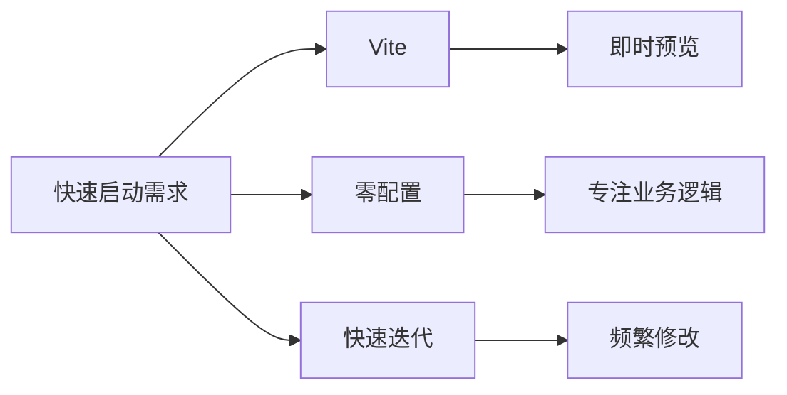
推荐：**Vite** - 最小化配置负担，专注于功能验证

**项目成长期（功能快速扩展）**
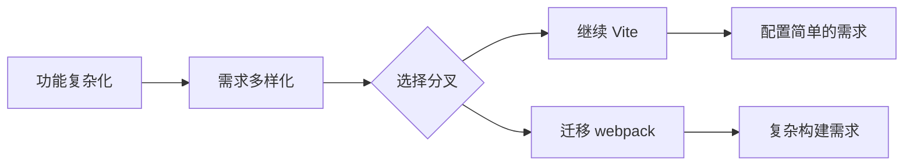

**项目成熟期（企业级应用）**
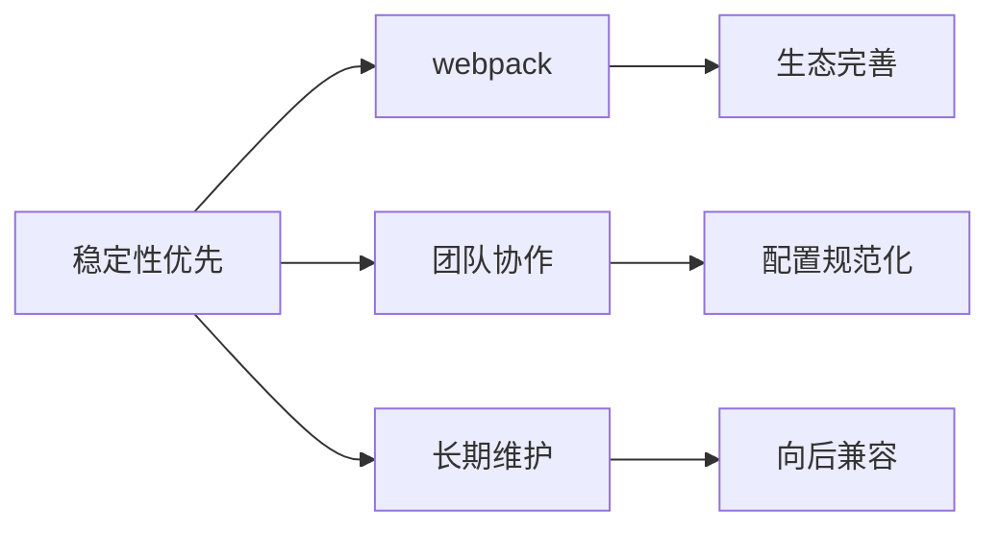

### 基于团队特征的选择

**技术团队画像分析**：

**初创团队**（1-5人，快速迭代）
- 优先级：开发效率 > 功能完整性
- 推荐：**Vite** - 快速启动，简单配置
- 理由：团队精力有限，需要专注核心业务

**成长团队**（5-15人，功能扩展）
- 优先级：平衡效率与可控性
- 推荐：**Vite** 或 **webpack**（根据复杂度）
- 理由：需要在效率和灵活性之间找平衡

**成熟团队**（15+人，企业级产品）
- 优先级：稳定性 > 开发效率
- 推荐：**webpack** - 完整的工程化解决方案
- 理由：有足够人力投入构建优化，需要精确控制

**开源维护者**（库/组件开发）
- 优先级：输出质量 > 开发体验
- 推荐：**Rollup** - 专业的库构建工具
- 理由：用户关心包大小和性能，不关心你的开发体验

## 🔄 技术演进路径

### 构建工具的进化逻辑

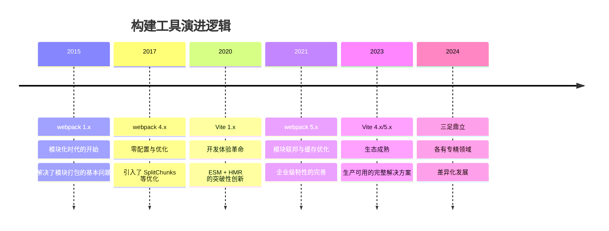

### 未来发展趋势预测

**webpack 的未来**：
- 专注企业级特性和稳定性
- 强化微前端、模块联邦等高级功能
- 与云原生、容器化部署深度结合

**Vite 的未来**：
- 成为现代前端开发的标准工具
- 继续优化开发体验和构建性能
- 扩展对更多框架和场景的支持

**Rollup 的未来**：
- 继续专精于库和组件构建
- 成为其他构建工具的底层引擎
- 推动 ES 模块标准的发展和应用

## ✅ 实践决策框架

### 选择决策树
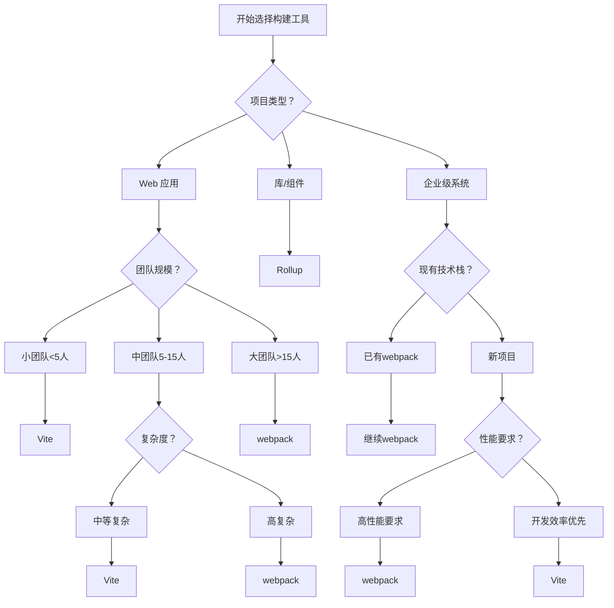

### 评估清单

**项目评估维度**：
```markdown
## 构建工具选择评估清单

### 项目特征 (30%)
- [ ] 项目类型：应用 / 库 / 组件
- [ ] 项目规模：小型 / 中型 / 大型  
- [ ] 复杂度：简单 / 中等 / 复杂
- [ ] 生命周期：原型 / 开发 / 成熟

### 团队因素 (25%)
- [ ] 团队规模：1-5 / 5-15 / 15+ 人
- [ ] 技术水平：初级 / 中级 / 高级
- [ ] webpack 经验：无 / 有 / 专家
- [ ] 学习意愿：低 / 中 / 高

### 技术要求 (25%)
- [ ] 开发体验重要性：低 / 中 / 高
- [ ] 构建性能要求：低 / 中 / 高
- [ ] 包大小敏感度：低 / 中 / 高
- [ ] 浏览器兼容性：现代 / 兼容 / 全兼容

### 业务约束 (20%)
- [ ] 时间压力：宽松 / 一般 / 紧急
- [ ] 维护成本：可接受 / 敏感 / 严格控制
- [ ] 技术债务：可接受 / 谨慎 / 零容忍
- [ ] 迁移成本：可接受 / 敏感 / 不可接受
```

**推荐算法**：
- **Vite 适合度 = 开发体验权重 × 0.4 + 配置简单性 × 0.3 + 现代化程度 × 0.3**
- **webpack 适合度 = 功能完整性 × 0.4 + 生态成熟度 × 0.3 + 团队经验 × 0.3**  
- **Rollup 适合度 = 库开发需求 × 0.6 + 输出质量要求 × 0.4**

## 🎯 最终建议

### 2024年构建工具选择指南

**优先推荐 Vite，当你的项目满足以下条件时**：
- ✅ 新的前端应用项目（非库）
- ✅ 团队追求高效的开发体验
- ✅ 现代浏览器环境（ES2015+）
- ✅ 没有特别复杂的构建需求
- ✅ 团队愿意拥抱新技术

**选择 webpack，当你需要以下能力时**：
- ✅ 企业级大型项目
- ✅ 复杂的构建需求（微前端、多入口等）
- ✅ 团队已有丰富的 webpack 经验
- ✅ 需要最大的生态兼容性
- ✅ 对稳定性有极高要求

**选择 Rollup，当你的项目是**：
- ✅ npm 包或组件库
- ✅ 需要多种输出格式
- ✅ 对包大小极度敏感
- ✅ 纯 ES 模块项目
- ✅ 追求最优的运行时性能

---

> **核心思想总结**：webpack 是工程师的瑞士军刀，Vite 是产品经理的完美工具，Rollup 是艺术家的精致画笔。选择哪个，取决于你是什么角色，解决什么问题。

