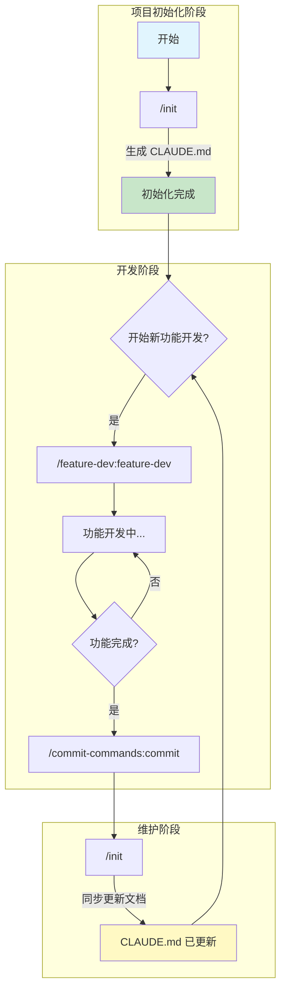

# Claude Code 开发工作流指南

本指南帮助你快速接入 Claude Code 开发工作流，提升 AI 辅助编程效率。

## 目录

- [前置准备](#前置准备)
- [项目初始化](#项目初始化)
- [功能开发](#功能开发)
- [代码提交](#代码提交)
- [文档维护](#文档维护)
- [工作流程图](#工作流程图)

---

## 前置准备

### 1. 配置用户级 CLAUDE.md

用户级 `CLAUDE.md` 用于配置全局的 Claude Code 行为偏好。

**文件位置：** `~/.claude/CLAUDE.md`

**推荐配置：**

```markdown
# Always reply in Chinese

# Creating a git commit without any signed endings
```

### 2. 安装官方插件市场

在 Claude Code 中执行以下命令：

```
/plugin marketplace add anthropics/claude-code
```

这将安装[官方的 Claude Code 插件](https://github.com/anthropics/claude-code/tree/main/plugins)市场，提供多种开发工具。

---

## 项目初始化

### Step 1: 执行官方初始化命令

```
/init
```

该命令会自动分析项目结构，生成初始的 `CLAUDE.md` 项目文档。

---

## 功能开发

使用 Feature Dev 插件进行功能开发：

```
/feature-dev:feature-dev
```

**使用技巧：**

- 尽量不要直接回车发送，可能会丢失信息
- 建议先完整描述需求后再发送

**示例交互方式：**


---

## 代码提交

功能开发完成后，使用以下命令生成规范的 Git Commit：

```
/commit-commands:commit
```

该命令会：
- 自动分析代码变更
- 生成符合规范的 commit message
- 支持多种 commit 风格

**示例效果：**


---

## 文档维护

当项目有重大变更时，可以再使用`/init` 命令更新 `CLAUDE.md`：


---

## 工作流程图



---

## 常用命令速查表

| 命令 | 用途 |
|------|------|
| `/init` | 初始化/更新项目 CLAUDE.md |
| `/feature-dev:feature-dev` | 功能开发引导 |
| `/commit-commands:commit` | 生成规范 commit |

---

## 相关资源

- [Claude Code 官方文档](https://docs.anthropic.com/en/docs/claude-code)
- [Claude Code 插件市场](https://github.com/anthropics/claude-code-plugins)
