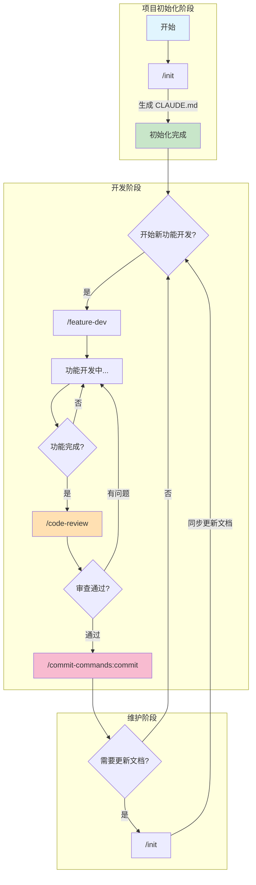

# 开发流程

实际使用时的流程笔记。

## 标准流程



## 流程说明

1. **初始化**：第一次用 `/init` 生成项目配置
2. **开发功能**：用 `/feature-dev` 开发新功能
3. **代码审查**：用 `/code-review` 审查代码质量和安全
4. **修复问题**：有问题回到开发阶段修复
5. **提交代码**：审查通过后用 `/commit-commands:commit` 或 `/commit-commands:commit-push-pr` 提交
6. **更新文档**：项目有大变化时用 `/init` 更新文档
7. 重复 2-6

## 注意事项

### 必须审查代码

- ✅ 每次提交前都用 `/code-review`
- ✅ 严重问题（🔴）必须修复
- ✅ 改进建议（🟡）看情况修复

### 需求描述要清楚

❌ 不好：
```
做一个登录
```

✅ 好：
```
实现登录功能

需求：POST /api/login，用户名+密码，返回JWT
技术栈：Express + MongoDB
集成点：src/routes/auth.js
```

### 一次性输入完整

不要一句一回车，容易丢信息。

### 敏感信息别提交

- API key、密码等放环境变量
- .env 加到 .gitignore

## 常见问题

**Q: 可以跳过 code-review 吗？**

不建议。审查能发现很多隐藏问题，特别是安全相关的。

**Q: code-review 说有问题但我觉得没问题？**

看问题等级：
- 🔴 严重问题 - 建议修复
- 🟡 改进建议 - 自己判断
- 可以忽略不合理的建议

**Q: 每次 code-review 都要全部修复吗？**

严重问题（🔴）必须修复，改进建议（🟡）看情况。

**Q: feature-dev 生成代码后要马上 code-review 吗？**

建议先看一眼代码，大致没问题再 code-review。如果明显不对，重新描述需求更快。

---

[[前置准备]] | [[常用斜杠命令]] | [[安装插件]]
