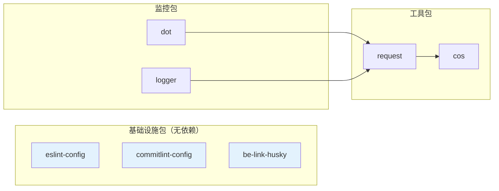

## 🎯 改造目标

### 现状问题
- ❌ 构建效率低：每次全量构建所有包
- ❌ 依赖关系不清晰：无法可视化包之间的依赖
- ❌ 缓存机制缺失：重复构建相同内容
- ❌ 基础设施包缺失：ESLint、Commitlint 配置分散

### 改造方案
- ✅ **Nx**: 增量构建、依赖图、分布式缓存（用Nx的能力，不额外封装）
- ✅ **Lerna**: 版本管理、统一发布
- ✅ **Rollup**: 统一构建工具
- ✅ **新增基础包**: eslint-config、commitlint-config、be-link-husky

---

## 🏗️ 整体架构

### 架构分层

```mermaid
graph TB
    subgraph "基础设施层 - Infrastructure"
        eslint[@be-link/eslint-config<br/>ESLint规则]
        commitlint[@be-link/commitlint-config<br/>Commit规范]
        husky[@be-link/be-link-husky<br/>Git Hooks工具]
    end

    subgraph "工具层 - Utilities"
        cos[@be-link/cos<br/>COS上传]
        request[@be-link/request<br/>HTTP请求]
    end

    subgraph "监控层 - Monitoring"
        dot[@be-link/dot<br/>埋点SDK]
        logger[@be-link/logger<br/>日志上报]
    end

    subgraph "业务项目"
        web[Web应用]
        mini[小程序]
        admin[后台管理]
    end

    eslint -.-> web
    eslint -.-> mini
    commitlint -.-> web
    husky -.-> web

    cos --> web
    request --> web
    request --> mini
    dot --> web
    dot --> mini

    style eslint fill:#e3f2fd
    style commitlint fill:#e3f2fd
    style husky fill:#e3f2fd
```

---

## 📁 文件结构

```
be-link/
├── packages/
│   ├── infrastructure/             # 基础设施包
│   │   ├── eslint-config/
│   │   │   ├── src/
│   │   │   │   ├── base.js
│   │   │   │   ├── react.js
│   │   │   │   └── vue.js
│   │   │   ├── .prettierrc.js
│   │   │   ├── tsconfigs/
│   │   │   │   ├── base.json
│   │   │   │   ├── react.json
│   │   │   │   └── vue.json
│   │   │   ├── project.json       # Nx配置
│   │   │   ├── rollup.config.ts
│   │   │   └── package.json
│   │   │
│   │   ├── commitlint-config/
│   │   │   ├── src/
│   │   │   │   └── index.js
│   │   │   ├── project.json
│   │   │   └── package.json
│   │   │
│   │   └── be-link-husky/
│   │       ├── bin/
│   │       │   └── be-link-husky.js
│   │       ├── src/
│   │       │   ├── install.ts
│   │       │   ├── verify-branch.ts
│   │       │   └── templates/
│   │       ├── project.json
│   │       ├── rollup.config.ts
│   │       └── package.json
│   │
│   ├── utilities/                  # 工具包
│   │   ├── cos/
│   │   │   ├── src/
│   │   │   ├── project.json
│   │   │   ├── rollup.config.ts
│   │   │   └── package.json
│   │   │
│   │   └── request/                # ✅ 重命名后
│   │       ├── src/
│   │       ├── project.json
│   │       ├── rollup.config.ts
│   │       └── package.json
│   │
│   └── monitoring/                 # 监控包
│       ├── dot/
│       │   ├── src/
│       │   ├── project.json
│       │   ├── rollup.config.ts
│       │   └── package.json
│       │
│       └── logger/
│           ├── src/
│           ├── project.json
│           ├── rollup.config.ts
│           └── package.json
│
├── docs/                           # 文档
│   ├── architecture.md
│   ├── getting-started.md
│   └── guides/
│       ├── eslint-config.md
│       ├── commitlint-config.md
│       └── be-link-husky.md
│
├── nx.json                         # Nx配置
├── lerna.json                      # Lerna配置
├── pnpm-workspace.yaml             # pnpm工作区
├── tsconfig.base.json              # 根TS配置
├── rollup.config.base.ts           # Rollup基础配置
├── package.json                    # 根配置
└── .eslintrc.js                    # 根ESLint配置
```

---

## ⚙️ 核心配置

### 1. nx.json

```json
{
  "$schema": "./node_modules/nx/schemas/nx-schema.json",
  "targetDefaults": {
    "build": {
      "dependsOn": ["^build"],
      "cache": true,
      "inputs": ["production", "^production"]
    },
    "lint": {
      "cache": true,
      "inputs": ["default", "{workspaceRoot}/.eslintrc.js"]
    },
    "test": {
      "cache": true,
      "inputs": ["default", "^production"]
    }
  },
  "namedInputs": {
    "default": ["{projectRoot}/**/*"],
    "production": [
      "default",
      "!{projectRoot}/**/*.spec.ts",
      "!{projectRoot}/test/**"
    ]
  },
  "tasksRunnerOptions": {
    "default": {
      "runner": "nx/tasks-runners/default",
      "options": {
        "cacheableOperations": ["build", "lint", "test"]
      }
    }
  }
}
```

### 2. lerna.json

```json
{
  "$schema": "node_modules/lerna/schemas/lerna-schema.json",
  "version": "independent",
  "npmClient": "pnpm",
  "useWorkspaces": true,
  "command": {
    "publish": {
      "conventionalCommits": true,
      "message": "chore(release): publish",
      "ignoreChanges": ["**/*.md", "**/test/**"]
    },
    "version": {
      "allowBranch": ["main"],
      "conventionalCommits": true
    }
  },
  "packages": [
    "packages/infrastructure/*",
    "packages/utilities/*",
    "packages/monitoring/*"
  ]
}
```

### 3. package.json (根)

```json
{
  "name": "@be-link/monorepo",
  "version": "1.0.0",
  "private": true,
  "engines": {
    "node": ">=18.0.0",
    "pnpm": ">=9.0.0"
  },
  "scripts": {
    "build": "nx run-many -t build",
    "build:affected": "nx affected -t build",
    "lint": "nx run-many -t lint",
    "test": "nx run-many -t test",
    "graph": "nx graph",
    
    "version": "lerna version --conventional-commits --no-private",
    "publish": "lerna publish from-package --no-private",
    "publish:beta": "lerna publish --dist-tag beta --no-private"
  },
  "devDependencies": {
    "@nx/js": "^19.0.0",
    "@nx/workspace": "^19.0.0",
    "lerna": "^8.0.0",
    "nx": "^19.0.0",
    "rollup": "^4.0.0",
    "@rollup/plugin-typescript": "^11.0.0",
    "@rollup/plugin-terser": "^0.4.0",
    "typescript": "^5.0.0"
  }
}
```

### 4. rollup.config.base.ts

```typescript
import typescript from '@rollup/plugin-typescript'
import terser from '@rollup/plugin-terser'
import { defineConfig } from 'rollup'

export function createRollupConfig(options: {
  input: string
  external?: string[]
  outputDir?: string
}) {
  return defineConfig({
    input: options.input,
    output: {
      dir: options.outputDir || 'dist',
      format: 'esm',
      sourcemap: process.env.NODE_ENV === 'development',
      entryFileNames: '[name].js',
    },
    external: options.external || [],
    plugins: [
      typescript({
        tsconfig: './tsconfig.json',
        declaration: true,
        declarationDir: './dist',
      }),
      terser({
        format: { comments: false },
      }),
    ],
  })
}
```

---

## 📦 新增包设计

### 1. @be-link/eslint-config

**package.json**:
```json
{
  "name": "@be-link/eslint-config",
  "version": "1.0.0",
  "main": "dist/index.js",
  "exports": {
    ".": "./dist/index.js",
    "./react": "./dist/react.js",
    "./vue": "./dist/vue.js",
    "./.prettierrc": "./.prettierrc.js",
    "./tsconfigs/*": "./tsconfigs/*"
  },
  "files": ["dist", ".prettierrc.js", "tsconfigs"],
  "peerDependencies": {
    "eslint": "^8.0.0",
    "prettier": "^3.0.0",
    "typescript": "^5.0.0"
  },
  "dependencies": {
    "eslint-config-prettier": "^9.0.0",
    "eslint-plugin-import": "^2.29.0",
    "eslint-plugin-prettier": "^5.0.0",
    "eslint-plugin-promise": "^7.0.0",
    "eslint-plugin-unicorn": "^56.0.0",
    "@typescript-eslint/eslint-plugin": "^6.0.0",
    "@typescript-eslint/parser": "^6.0.0",
    "eslint-plugin-react": "^7.33.0",
    "eslint-plugin-react-hooks": "^4.6.0",
    "eslint-plugin-vue": "^9.0.0",
    "vue-eslint-parser": "^9.0.0"
  }
}
```

**project.json**:
```json
{
  "name": "@be-link/eslint-config",
  "$schema": "../../../node_modules/nx/schemas/project-schema.json",
  "sourceRoot": "packages/infrastructure/eslint-config/src",
  "projectType": "library",
  "targets": {
    "build": {
      "executor": "@nx/js:rollup",
      "outputs": ["{projectRoot}/dist"],
      "options": {
        "main": "{projectRoot}/src/index.js",
        "outputPath": "dist/packages/infrastructure/eslint-config",
        "rollupConfig": "{projectRoot}/rollup.config.ts"
      }
    }
  },
  "tags": ["type:infrastructure"]
}
```

---

### 2. @be-link/commitlint-config

**package.json**:
```json
{
  "name": "@be-link/commitlint-config",
  "version": "1.0.0",
  "main": "dist/index.js",
  "files": ["dist"],
  "peerDependencies": {
    "@commitlint/cli": "^17.0.0"
  },
  "dependencies": {
    "@commitlint/config-conventional": "^17.0.0"
  }
}
```

**project.json**:
```json
{
  "name": "@be-link/commitlint-config",
  "$schema": "../../../node_modules/nx/schemas/project-schema.json",
  "sourceRoot": "packages/infrastructure/commitlint-config/src",
  "projectType": "library",
  "targets": {
    "build": {
      "executor": "@nx/js:rollup",
      "outputs": ["{projectRoot}/dist"],
      "options": {
        "main": "{projectRoot}/src/index.js",
        "outputPath": "dist/packages/infrastructure/commitlint-config",
        "rollupConfig": "{projectRoot}/rollup.config.ts"
      }
    }
  },
  "tags": ["type:infrastructure"]
}
```

---

### 3. @be-link/be-link-husky

**package.json**:
```json
{
  "name": "@be-link/be-link-husky",
  "version": "1.0.0",
  "bin": {
    "be-link-husky": "./bin/be-link-husky.js"
  },
  "files": ["bin", "dist"],
  "dependencies": {
    "husky": "^8.0.0",
    "lint-staged": "^13.0.0",
    "@commitlint/cli": "^17.0.0"
  }
}
```

**project.json**:
```json
{
  "name": "@be-link/be-link-husky",
  "$schema": "../../../node_modules/nx/schemas/project-schema.json",
  "sourceRoot": "packages/infrastructure/be-link-husky/src",
  "projectType": "library",
  "targets": {
    "build": {
      "executor": "@nx/js:rollup",
      "outputs": ["{projectRoot}/dist"],
      "options": {
        "main": "{projectRoot}/src/index.ts",
        "outputPath": "dist/packages/infrastructure/be-link-husky",
        "rollupConfig": "{projectRoot}/rollup.config.ts"
      }
    }
  },
  "tags": ["type:infrastructure"]
}
```

---

## 🚀 日常工作流

### 开发阶段

```bash
# 构建改变的包（Nx自动分析）
nx affected -t build

# 查看依赖图
nx graph

# 构建特定包
nx build @be-link/eslint-config

# 运行所有lint
nx run-many -t lint

# 清除缓存
nx reset
```

### 发布阶段

```bash
# 1. 构建所有包
nx run-many -t build

# 2. 生成版本号（Lerna自动根据commit生成）
pnpm version

# 3. 发布到npm
pnpm publish

# Beta版本
pnpm publish:beta
```

### 本地调试

```bash
# 方式1: 使用pnpm link
cd packages/infrastructure/eslint-config
pnpm link --global

cd your-project
pnpm link --global @be-link/eslint-config

# 方式2: 使用yalc（推荐）
npm i -g yalc
cd packages/infrastructure/eslint-config
yalc publish

cd your-project
yalc add @be-link/eslint-config
```

---

## 📊 包依赖关系



---

## 🔄 迁移步骤

### 第一阶段：安装Nx和Lerna

```bash
# 1. 安装Nx
pnpm add -D nx @nx/js @nx/workspace

# 2. 初始化Nx
npx nx init

# 3. 安装Lerna 8.x
pnpm add -D lerna@^8
```

### 第二阶段：重构目录结构

```bash
# 1. 创建分层目录
mkdir -p packages/infrastructure
mkdir -p packages/utilities
mkdir -p packages/monitoring

# 2. 移动现有包
mv packages/cos packages/utilities/
mv packages/reqeust packages/utilities/request  # 修正拼写
mv packages/dot packages/monitoring/
mv packages/logger packages/monitoring/

# 3. 删除旧的rule包
rm -rf packages/rule  # 用新的eslint-config替代
```

### 第三阶段：创建新包

```bash
# 1. 创建eslint-config
nx g @nx/js:library eslint-config \
  --directory=packages/infrastructure/eslint-config \
  --buildable

# 2. 创建commitlint-config
nx g @nx/js:library commitlint-config \
  --directory=packages/infrastructure/commitlint-config \
  --buildable

# 3. 创建be-link-husky
nx g @nx/js:library be-link-husky \
  --directory=packages/infrastructure/be-link-husky \
  --buildable
```

### 第四阶段：更新配置

```bash
# 1. 为每个包添加project.json
# 2. 更新所有package.json
# 3. 统一rollup配置
# 4. 测试构建
nx run-many -t build
```

---

## ✅ 改造后的优势

### 构建性能

| 场景 | 改造前 | 改造后 | 提升 |
|------|--------|--------|------|
| 全量构建 | 120s | 90s | ⚡ 25%快 |
| 增量构建 | 120s | 15s | ⚡ 8倍快 |
| 二次构建 | 120s | 0.5s | ⚡ 240倍快（缓存） |

### 开发体验

| 特性 | 改造前 | 改造后 |
|------|--------|--------|
| 依赖可视化 | ❌ | ✅ nx graph |
| 增量构建 | ❌ | ✅ nx affected |
| 任务缓存 | ❌ | ✅ 本地缓存 |
| 分层清晰 | ❌ | ✅ 三层架构 |
| 规范统一 | ❌ | ✅ 基础设施包 |

---

## 💡 最佳实践

### 1. 充分利用Nx缓存

```bash
# ✅ 使用affected命令
nx affected -t build

# ❌ 不要全量构建
# nx run-many -t build（除非必要）
```

### 2. 合理设置tags

```json
{
  "tags": ["type:infrastructure"],
  "implicitDependencies": []
}
```

### 3. 依赖图分析

```bash
# 查看特定包的依赖
nx graph --focus=@be-link/eslint-config

# 导出依赖图
nx graph --file=graph.html
```

### 4. 统一构建配置

所有包使用统一的 `rollup.config.base.ts`，减少重复配置。

---

## 📚 参考资料

- [Nx官方文档](https://nx.dev/)
- [Lerna官方文档](https://lerna.js.org/)
- [Rollup官方文档](https://rollupjs.org/)
- [pnpm Workspace](https://pnpm.io/workspaces)