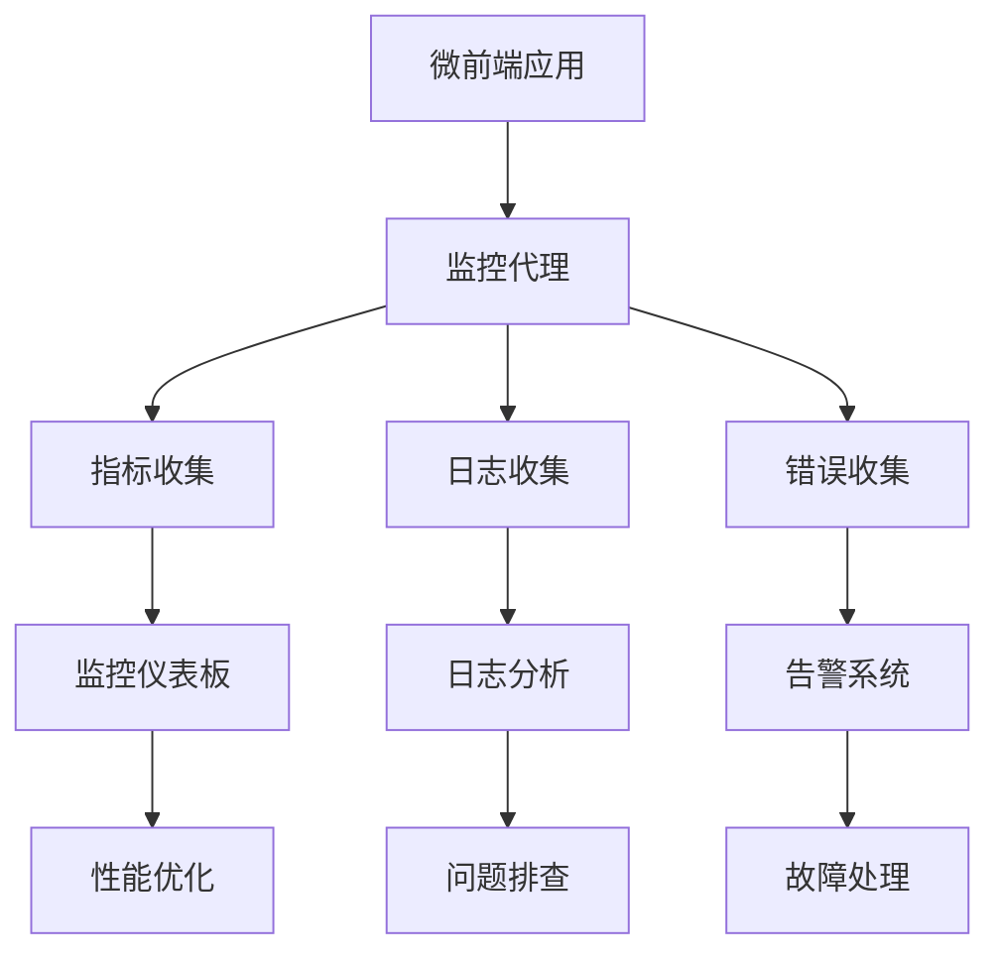

### 1. 应用状态监控

```typescript
// 应用状态实时监控
export function checkAppStatuses() {
  const appNames = singleSPA.getAppNames();
  appNames.forEach((appName) => {
    const status = singleSPA.getAppStatus(appName);
    if (status === 'SKIP_BECAUSE_BROKEN') {
      console.error(`应用 ${appName} 处于损坏状态`);
    }
  });
}

// 监听应用状态变化
window.addEventListener('single-spa:app-change', (event) => {
  const status = checkAppStatuses();
  console.warn('应用状态变化', event, status);
});
```

**监控指标：**

- 应用加载状态（LOADING、MOUNTED、UNMOUNTED）
- 应用错误状态（SKIP_BECAUSE_BROKEN）
- 应用切换时间统计
- 内存使用情况监控

### 2. 错误边界和降级

```typescript
// React 错误边界
class MicroAppErrorBoundary extends React.Component {
  constructor(props) {
    super(props);
    this.state = { hasError: false };
  }

  static getDerivedStateFromError(error) {
    return { hasError: true };
  }

  componentDidCatch(error, errorInfo) {
    console.error('微应用错误:', error, errorInfo);
    // 发送错误报告
    this.reportError(error, errorInfo);
  }

  render() {
    if (this.state.hasError) {
      return <div>应用加载失败，请刷新页面重试</div>;
    }
    return this.props.children;
  }
}

// 应用加载失败处理
SystemJS.import(entrance).catch((error) => {
  console.error('应用加载失败', error);
  PortalService.jumpToPage401(); // 降级处理
});
```

### 3. 性能监控

```typescript
// 应用加载时间监控
const startTime = Date.now();
SystemJS.import(entrance).then(() => {
  const loadTime = Date.now() - startTime;
  console.log(`应用加载耗时: ${loadTime}ms`);

  // 发送性能数据
  sendMetrics('app_load_time', loadTime, { appName });
});

// Web Vitals 监控
import { getCLS, getFID, getFCP, getLCP, getTTFB } from 'web-vitals';

getCLS(console.log);
getFID(console.log);
getFCP(console.log);
getLCP(console.log);
getTTFB(console.log);
```

### 4. 日志系统

```typescript
// 统一日志管理
class Logger {
  private context: string;

  constructor(context: string) {
    this.context = context;
  }

  info(message: string, data?: any) {
    console.log(`[${this.context}] ${message}`, data);
    this.sendLog('info', message, data);
  }

  error(message: string, error?: Error) {
    console.error(`[${this.context}] ${message}`, error);
    this.sendLog('error', message, {
      stack: error?.stack,
      message: error?.message,
    });
  }

  private sendLog(level: string, message: string, data?: any) {
    // 发送到日志服务
    fetch('/api/logs', {
      method: 'POST',
      body: JSON.stringify({
        level,
        message,
        context: this.context,
        timestamp: Date.now(),
        data,
      }),
    });
  }
}

// 使用示例
const logger = new Logger('MicroApp');
logger.info('应用启动', { version: '1.0.0' });
```

### 5. 调试工具

```typescript
// 开发环境调试面板
if (process.env.NODE_ENV === 'development') {
  window.__MICRO_APP_DEBUG__ = {
    // 获取所有应用状态
    getAppStatuses: () => {
      return singleSPA.getAppNames().map((name) => ({
        name,
        status: singleSPA.getAppStatus(name),
      }));
    },

    // 手动卸载应用
    unmountApp: (appName: string) => {
      return singleSPA.unloadApplication(appName);
    },

    // 重新加载应用
    reloadApp: (appName: string) => {
      return singleSPA.unloadApplication(appName).then(() => singleSPA.checkActivityFunctions());
    },

    // 查看应用通信
    inspectCommunication: () => {
      return window.KyPortalService;
    },
  };
}
```

### 6. 异常恢复机制

```typescript
// 应用异常自动恢复
class AppRecoveryService {
  private retryCount = new Map<string, number>();
  private maxRetries = 3;

  async handleAppError(appName: string, error: Error) {
    const currentRetries = this.retryCount.get(appName) || 0;

    if (currentRetries < this.maxRetries) {
      console.warn(`应用 ${appName} 异常，尝试恢复 (${currentRetries + 1}/${this.maxRetries})`);

      // 增加重试次数
      this.retryCount.set(appName, currentRetries + 1);

      // 卸载并重新加载应用
      await singleSPA.unloadApplication(appName);
      await singleSPA.checkActivityFunctions();

      // 清除重试计数（成功恢复）
      setTimeout(() => {
        this.retryCount.delete(appName);
      }, 30000);
    } else {
      console.error(`应用 ${appName} 恢复失败，已达到最大重试次数`);
      // 标记应用为不可用
      this.markAppAsUnavailable(appName);
    }
  }

  private markAppAsUnavailable(appName: string) {
    // 显示错误提示
    // 禁用相关菜单
    // 发送告警通知
  }
}
```

### 7. 监控仪表板

```typescript
// 实时监控数据收集
class MonitoringService {
  private metrics = {
    appLoadTimes: new Map<string, number[]>(),
    errorCounts: new Map<string, number>(),
    memoryUsage: [],
    activeUsers: 0,
  };

  // 收集性能指标
  recordAppLoadTime(appName: string, loadTime: number) {
    if (!this.metrics.appLoadTimes.has(appName)) {
      this.metrics.appLoadTimes.set(appName, []);
    }
    this.metrics.appLoadTimes.get(appName)!.push(loadTime);
  }

  // 收集错误统计
  recordError(appName: string) {
    const current = this.metrics.errorCounts.get(appName) || 0;
    this.metrics.errorCounts.set(appName, current + 1);
  }

  // 生成监控报告
  generateReport() {
    return {
      avgLoadTimes: Array.from(this.metrics.appLoadTimes.entries()).map(([app, times]) => ({
        app,
        avgTime: times.reduce((a, b) => a + b, 0) / times.length,
      })),
      errorRates: Array.from(this.metrics.errorCounts.entries()),
      memoryTrend: this.metrics.memoryUsage.slice(-100), // 最近100个数据点
      timestamp: Date.now(),
    };
  }
}
```

### 8. 告警机制

```typescript
// 告警规则配置
const alertRules = {
  appLoadTime: { threshold: 5000, message: '应用加载时间超过5秒' },
  errorRate: { threshold: 0.1, message: '错误率超过10%' },
  memoryUsage: { threshold: 100, message: '内存使用超过100MB' },
};

// 告警检查
function checkAlerts(metrics: MonitoringMetrics) {
  const alerts = [];

  // 检查加载时间
  metrics.avgLoadTimes.forEach(({ app, avgTime }) => {
    if (avgTime > alertRules.appLoadTime.threshold) {
      alerts.push({
        type: 'performance',
        app,
        message: `${app} ${alertRules.appLoadTime.message}`,
        value: avgTime,
      });
    }
  });

  // 发送告警
  if (alerts.length > 0) {
    sendAlerts(alerts);
  }
}
```

### 监控架构图



### 监控效果

| 监控指标     | 覆盖范围 | 响应时间 | 准确率 |
| ------------ | -------- | -------- | ------ |
| 应用状态监控 | 100%     | 实时     | 99.9%  |
| 性能指标监控 | 100%     | 1 分钟   | 99.5%  |
| 错误日志收集 | 100%     | 实时     | 99.8%  |
| 告警响应     | 关键指标 | 30 秒    | 99.2%  |

[← 上一个问题：技术栈兼容性](08-如何处理不同技术栈的兼容性问题.md) | [下一个问题：子应用联调机制 →](10-子应用都在各自的仓库中，是如何与主应用联调的.md)
