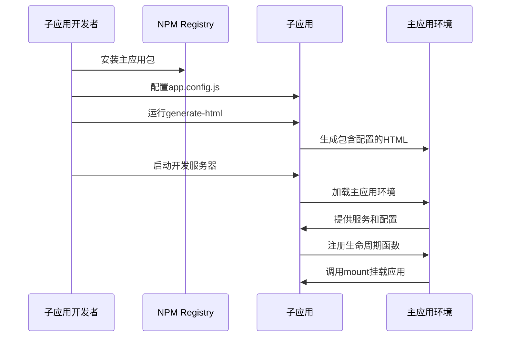

这是一个复杂的架构设计问题，我们从三个层面来设计解决方案：

## 一、主应用架构设计 - 双重身份设计

### 主应用需要承担两个角色

1. **独立运行的 Portal Shell** - 生产环境的主应用
2. **可被依赖的 NPM 包** - 开发环境的工具包

### 架构分层设计

```typescript
// 主应用服务层抽象
// packages/business/src/services/index.ts
import { PortalService } from '@common/services/portal';
import { DependencieService } from '@business/services/dependencies';

// 扩展Portal服务，为子应用提供更多能力
PortalService.DependencieService = DependencieService; // Angular依赖管理
PortalService.BusinessMenuService = BusinessMenuService; // 菜单服务
PortalService.QWAssistantService = QWAssistantService; // 企微服务

// 暴露全局服务供子应用使用
(window as any).KyPortalService = PortalService;
```

### 双重构建策略

```javascript
// packages/business/scripts/publish.js
function build() {
  // 1. 主应用构建 - 用于生产环境
  execa.sync(webpackPath, ['--config', 'webpack/prod.js']);

  // 2. 开发工具构建 - 用于子应用开发
  execa.sync(webpackPath, ['--config', 'webpack/build-for-app.js']);

  // 3. 构建npm包内容
  const packageJsonString = JSON.stringify({
    name: '@shuyun-ep-team/portal',
    version: packageJson.version,
    main: 'index.html',
    bin: { 'portal-tools': 'generate-html.js' }, // CLI工具
    dependencies: {
      minimist: '^1.2.0',
      'sanitize-html': '^1.19.0',
    },
  });

  // 4. 复制核心服务接口定义
  fs.writeFileSync('dist/portal-service.d.ts', fs.readFileSync('../../common/interfaces/portal-service.d.ts'));
}
```

## 二、设计决策考量 - 为什么这么设计

### 1. 解决核心矛盾：独立性 vs 一致性

```typescript
// 问题：子应用需要独立开发，但又要保证与主应用的一致性
// 解决：通过版本化的npm包分发主应用能力

// 版本管理策略
function prePublish() {
  return getCurrentVersion().then((version) => {
    if (semver.lte(packageJson.version, version)) {
      throw new Error('当前发布版本必须大于上次发布版本');
    }
  });
}
```

### 2. 环境隔离机制设计

```typescript
// 主应用需要能够识别运行环境
if (process.env.isForAppDevCI) {
  // 开发模式：使用子应用提供的配置
  setItem('CCMS_INFOS_CONFIG', window.CCMS_INFOS_CONFIG);
} else {
  // 生产模式：从后端API获取配置
  await SystemStore.fetchConfigAndSetCCMSConfigScript();
}
```

### 3. 服务能力统一抽象

```typescript
// 设计统一的服务接口，保证主子应用能力一致
interface IPortalService {
  LoginService: ILoginService; // 登录服务
  EventBusServices: IEventBus; // 事件总线
  DependencieService: IDependence; // 依赖管理（Angular专用）
  ThemeService: IThemeService; // 主题服务
  LanguageService: ILanguageService; // 国际化服务
}

// 子应用通过生命周期函数获取服务
export function bootstrap(config: IPortalService) {
  const { LoginService, EventBusServices, DependencieService } = config;
  // 子应用可以使用主应用的所有服务能力
}
```

## 三、子应用接入机制 - 标准化流程

### 1. 标准化项目结构

```
子应用项目/
├── app.config.js           # 环境配置文件
├── src/
│   └── entry.js           # 入口文件（实现生命周期）
├── package.json           # 依赖主应用npm包
└── webpack.config.js      # 构建配置
```

### 2. 生命周期标准实现

```typescript
// 子应用必须实现的标准接口
export function bootstrap(config: IPortalService) {
  // 初始化阶段：设置全局依赖和配置
  const { DependencieService } = config;
  return DependencieService.load(['angular@1.5.8', 'angular-resource@1.5.8']);
}

export function mount(config: IPortalService) {
  // 挂载阶段：渲染应用到指定容器
  const { root } = config;
  return import('./app').then((app) => {
    ReactDOM.render(<App />, root);
  });
}

export function unmount(config: IPortalService) {
  // 卸载阶段：清理资源和DOM
  const { root } = config;
  ReactDOM.unmountComponentAtNode(root);
  return Promise.resolve();
}
```

### 3. 配置驱动的环境模拟

```javascript
// app.config.js - 子应用的环境配置
module.exports = {
  // 系统配置模拟
  CCMS_INFOS_CONFIG: {
    TENANT: 'local-dev',
    UAL: 'https://ual-dev.kylin.shuyun.com',
    SAAS: 'false',
  },
  // 应用注册信息
  APP: {
    name: 'my-child-app',
    entrance: 'http://localhost:3001/entry.js',
    rootHash: '/child-app',
  },
  // 菜单配置（可选）
  MENUS: [
    /* 本地菜单数据 */
  ],
};
```

### 4. 自动化开发工具链

```json
// 子应用package.json
{
  "devDependencies": {
    "@shuyun-ep-team/portal": "^4.17.0"
  },
  "scripts": {
    "dev:prepare": "portal-tools --configPath ./app.config.js",
    "dev:start": "npm run dev:prepare && webpack-dev-server",
    "dev": "concurrently \"npm run dev:start\" \"echo '主应用环境已就绪'\""
  }
}
```

### 联调流程图



## 技术创新点

- ✅ **双重身份设计** - 主应用既是 Portal 又是工具包
- ✅ **版本化能力分发** - 通过 npm 版本管理主应用能力更新
- ✅ **环境自动识别** - 主应用智能区分开发/生产环境
- ✅ **服务能力统一** - 子应用获得与主应用完全一致的服务能力
- ✅ **标准化接入** - 降低子应用开发门槛和维护成本

## 这种设计解决的根本问题

如何在保证微前端架构灵活性的同时，实现子应用的完全独立开发，并确保主子应用的技术栈和能力完全一致。

### 开发体验对比

| 对比项目   | 传统方式           | 我们的方案       | 优势   |
| ---------- | ------------------ | ---------------- | ------ |
| 环境依赖   | 需要启动完整主应用 | 只需安装 npm 包  | 轻量化 |
| 配置复杂度 | 复杂的环境配置     | 单个配置文件     | 简单化 |
| 开发独立性 | 依赖主应用代码     | 完全独立开发     | 解耦合 |
| 版本管理   | 手动同步更新       | npm 版本自动管理 | 自动化 |

[← 上一个问题：监控和调试](09-微前端架构的监控和调试如何实现.md) | [下一个问题：架构改进思考 →](11-如果重新设计，你会做哪些改进.md)
