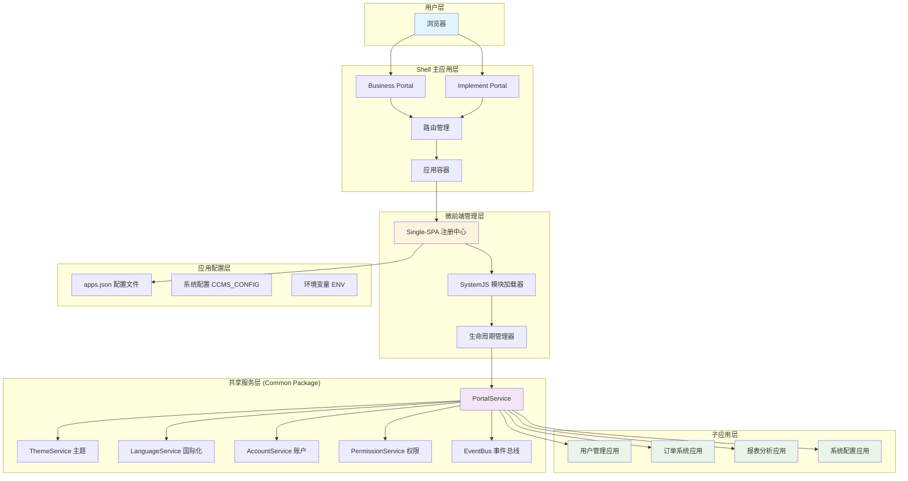

我们的微前端架构是基于 **Single-SPA + SystemJS** 的企业级解决方案，采用了 **Monorepo + 配置化管理** 的设计模式，实现了多个业务应用的统一管理和独立开发。

### 整体架构分层

我们的架构采用了四层设计，每一层都有明确的职责分工：

#### 1. **Shell 主应用层（容器层）**

- **职责**：作为微前端的"容器"，提供统一的入口和基础框架
- **技术栈**：React + TypeScript + Webpack
- **核心功能**：
  - 应用启动和初始化
  - 全局路由管理（Hash 路由）
  - 统一的页面布局（Header、Menu、Content）
  - 全局错误处理和异常捕获

```typescript
// packages/business/src/index.tsx - Business端启动
import { bootstrapSpaService } from '@common/services/spa';

// 启动微前端服务
bootstrapSpaService('Business');
```

#### 2. **微前端管理层（编排层）**

- **职责**：负责子应用的注册、加载、生命周期管理
- **核心技术**：
  - **Single-SPA**：提供应用注册和生命周期管理
  - **SystemJS**：实现应用的动态加载和模块化

```typescript
// packages/common/services/spa/helper.ts - 应用注册核心逻辑
export function initSpaService(apps: IApp[]) {
  apps.forEach((app) => {
    // 1. 构建防缓存的入口地址
    const entrance = `${app.entrance}?tsPortal=${Date.now()}`;

    // 2. 定义应用加载函数
    const loadingFnc = () => {
      SpaStore.update({ isLoading: true });
      return SystemJS.import(entrance).then((entranceModule) => {
        // 3. 封装标准生命周期
        return {
          bootstrap: (data) => entranceModule.bootstrap(data),
          mount: (data) => entranceModule.mount(data),
          unmount: (data) => entranceModule.unmount(data),
        };
      });
    };

    // 4. 注册到Single-SPA
    singleSPA.registerApplication(app.name, loadingFnc, hashPrefix(app.rootHash), PortalService);
  });

  // 5. 启动Single-SPA路由监听
  singleSPA.start();
}
```

#### 3. **共享服务层（Common Package）**

- **职责**：提供跨应用的通用服务、组件和工具
- **设计模式**：服务化架构，通过 PortalService 统一暴露

```typescript
// packages/common/services/portal/index.ts - 服务集合
export const PortalService = {
  // 核心服务
  ThemeService, // 主题管理
  LanguageService, // 国际化
  AccountService, // 账户管理
  PermissionService, // 权限控制

  // 微前端专用服务
  SpaService, // 应用管理
  BreadcrumbService, // 面包屑导航

  // 工具服务
  RequestService, // HTTP请求
  JsonPackageService, // JSON配置加载

  // 事件总线
  EventBusServices: {
    menu: MenuEventBus,
    language: LanguageEventBus,
    permission: PermissionEventBus,
  },
};
```

#### 4. **子应用层（业务层）**

- **Business 应用**：面向最终用户的业务功能
- **Implement 应用**：面向管理员的配置和管理功能
- **特点**：每个应用独立开发、测试、部署

### 配置化应用管理

我们采用 JSON 配置文件来管理应用，实现了"配置即代码"的理念：

#### 应用配置示例

```json
// /web-common-resource/configs/portal/apps.json
[
  {
    "name": "user-management",
    "entrance": "http://cdn.example.com/apps/user-management/entry.js",
    "rootHash": "/user",
    "props": {
      "container": "#subapp-container",
      "theme": "default"
    }
  },
  {
    "name": "order-system",
    "entrance": "http://cdn.example.com/apps/order-system/entry.js",
    "rootHash": "/order",
    "props": {
      "container": "#subapp-container"
    }
  }
]
```

#### 配置加载机制

```typescript
// packages/common/services/spa/store.ts - 配置获取
class SPAStore {
  public fetch(source: 'Business' | 'Implement') {
    const configPath =
      source === 'Business'
        ? '/web-common-resource/configs/portal/apps.json'
        : '/web-common-resource/configs/implement/apps.json';

    return JsonPackageService.fetch(configPath).then((apps) => {
      // 支持开发环境动态配置
      if (process.env.isForAppDevCI) {
        const devApps = (window as any).APPS || apps;
        return devApps;
      }
      return apps;
    });
  }
}
```

### 应用生命周期管理

每个子应用都必须实现标准的生命周期接口：

#### 1. Bootstrap 阶段（初始化）

```typescript
export function bootstrap(props) {
  console.log('应用初始化', props);

  // 1. 初始化应用配置
  // 2. 注册全局服务
  // 3. 设置错误边界

  return Promise.resolve();
}
```

#### 2. Mount 阶段（挂载）

```typescript
export function mount(props) {
  console.log('应用挂载', props);

  // 1. 获取挂载容器
  const container = document.querySelector(props.container);

  // 2. 渲染应用
  ReactDOM.render(<App />, container);

  // 3. 更新面包屑导航
  BreadcrumbService.render('用户管理');

  return Promise.resolve();
}
```

#### 3. Unmount 阶段（卸载）

```typescript
export function unmount(props) {
  console.log('应用卸载', props);

  // 1. 清理DOM
  const container = document.querySelector(props.container);
  ReactDOM.unmountComponentAtNode(container);

  // 2. 清理事件监听
  // 3. 清理定时器
  // 4. 重置面包屑
  BreadcrumbService.render('');

  return Promise.resolve();
}
```

### 核心技术解析

#### Single-SPA：应用编排器

Single-SPA 就像一个"应用调度员"，它负责：

- **注册应用**：告诉系统有哪些应用可用
- **路由匹配**：根据 URL 决定激活哪个应用
- **生命周期管理**：在合适的时机启动、挂载、卸载应用

#### SystemJS：模块加载器

SystemJS 就像一个"动态加载器"，它能够：

- **运行时加载**：不需要重新编译就能加载新模块
- **格式兼容**：支持 ES6、CommonJS、AMD 等多种模块格式
- **依赖管理**：自动处理模块间的依赖关系

#### 实际运行流程

```typescript
// 用户访问 #/user/profile 时的完整流程：

// 1. Single-SPA 检测路由变化
singleSPA.navigateToUrl('#/user/profile');

// 2. 匹配应用规则
const matchedApp = apps.find((app) => location.hash.startsWith(app.rootHash));

// 3. SystemJS 动态加载应用
const entranceModule = await SystemJS.import(matchedApp.entrance);

// 4. 执行生命周期
await entranceModule.bootstrap(PortalService);
await entranceModule.mount({
  container: '#subapp-container',
  ...PortalService,
});

// 5. 应用成功渲染到页面
```

### 架构优势与特点

#### 1. **技术栈无关性**

```typescript
// 支持不同技术栈的应用共存
const apps = [
  { name: 'react-app', framework: 'React 18' },
  { name: 'vue-app', framework: 'Vue 3' },
  { name: 'angular-app', framework: 'Angular 15' },
];
```

#### 2. **独立部署能力**

- 每个应用有独立的构建流程
- 支持灰度发布和回滚
- CDN 分发，提升加载性能

#### 3. **开发团队隔离**

- 代码仓库独立管理
- 技术选型自主决定
- 发布节奏各自控制

### 详细架构图



### 关键设计模式

#### 1. **配置驱动架构**

```typescript
// 通过配置文件控制应用行为
interface AppConfig {
  name: string; // 应用唯一标识
  entrance: string; // 入口文件地址
  rootHash: string; // 路由前缀
  props?: any; // 传递给应用的属性
  dependencies?: string[]; // 依赖的其他应用
}
```

#### 2. **服务注入模式**

```typescript
// 主应用向子应用注入服务
singleSPA.registerApplication(
  app.name,
  loadingFunction,
  activeFunction,
  PortalService, // 注入的服务对象
);

// 子应用接收服务
export function mount(props) {
  const { ThemeService, LanguageService } = props;
  // 使用注入的服务
}
```

#### 3. **事件驱动通信**

```typescript
// 跨应用事件通信
PortalService.EventBusServices.language.emit('languageChange', {
  language: 'en-US',
});

// 应用监听事件
PortalService.EventBusServices.language.on('languageChange', (data) => {
  // 处理语言切换
});
```

### 性能优化策略

#### 1. **应用预加载**

```typescript
// 关键应用预加载
const criticalApps = ['user-management', 'dashboard'];
criticalApps.forEach((appName) => {
  singleSPA.prefetchApps([appName]);
});
```

#### 2. **缓存策略**

```typescript
// 生产环境长期缓存，开发环境防缓存
const entrance = process.env.NODE_ENV === 'production' ? app.entrance : `${app.entrance}?tsPortal=${Date.now()}`;
```

#### 3. **错误边界处理**

```typescript
// 应用加载失败的降级处理
SystemJS.import(entrance).catch((error) => {
  console.error('应用加载失败', error);

  // 显示错误页面或降级到默认应用
  PortalService.jumpToPage404();

  // 上报错误信息
  PortalService.InspectService.reportError(error);
});
```

### 最佳实践总结

#### 1. **应用设计原则**

- **单一职责**：每个应用专注特定业务域
- **低耦合**：通过标准接口通信，避免直接依赖
- **高内聚**：相关功能组织在同一应用内

#### 2. **开发规范**

```typescript
// 标准的应用入口文件结构
export async function bootstrap(props) {
  // 1. 初始化应用配置
  // 2. 设置错误边界
  // 3. 注册全局服务
}

export async function mount(props) {
  // 1. 创建应用实例
  // 2. 挂载到指定容器
  // 3. 启动路由监听
}

export async function unmount(props) {
  // 1. 清理DOM和事件
  // 2. 销毁应用实例
  // 3. 重置全局状态
}
```

#### 3. **常见问题解决**

**路由冲突**：

```typescript
// 使用路径前缀隔离
export function hashPrefix(prefix: string) {
  return (location) => location.hash.startsWith(`#${prefix}`);
}
```

**样式隔离**：

```typescript
// 使用 JSS + 命名空间
const generateClassName = createGenerateClassName({
  productionPrefix: 'portal-app',
});
```

**状态隔离**：

```typescript
// 每个应用维护独立的状态管理
const store = createStore(reducer, {
  namespace: 'user-management',
});
```

这种架构设计让我们能够支持大规模团队协作，实现了业务应用的快速迭代和独立部署，同时保证了整体系统的稳定性和一致性。

[← 上一个问题：为什么选择微前端](01-为什么选择微前端架构？解决了什么问题？.md) | [下一个问题：应用通信机制 →](03-主从应用之间是如何通信的.md)
